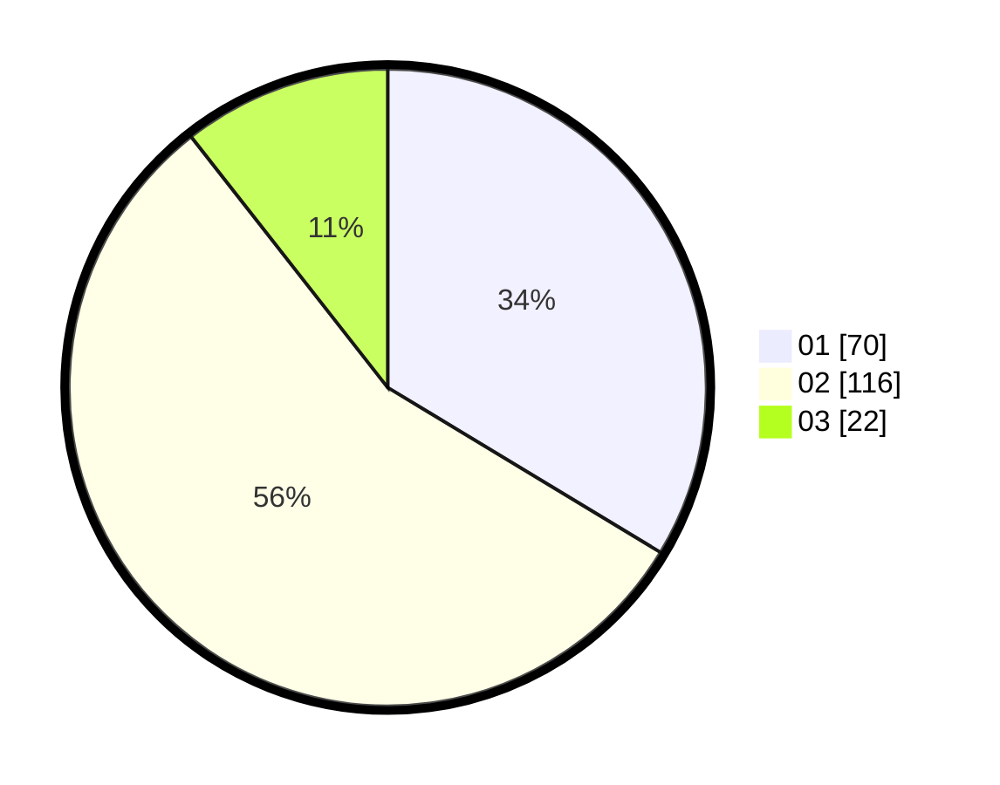

# Hasil

Hasil perolehan suara paslon dapat dilihat pada file paslon-01.txt, paslon-02.txt, dan paslon-03.txt.

Jika tidak ada, artinya data tersebut belum ada pada SIREKAP.

## Perolehan Suara

 * Paslon 01: **70**.
 * Paslon 02: **116**.
 * Paslon 03: **22**.

## Foto C Plano

https://sirekap-obj-formc.kpu.go.id/ecef/pemilu/ppwp/31/73/06/10/03/3173061003018-20240214-195652--3dea9d90-578d-4999-afe8-82a322848de6.jpg

https://sirekap-obj-formc.kpu.go.id/ecef/pemilu/ppwp/31/73/06/10/03/3173061003018-20240216-142646--1debaf11-a96e-49d3-9e49-df24c7c8d3c8.jpg

https://sirekap-obj-formc.kpu.go.id/ecef/pemilu/ppwp/31/73/06/10/03/3173061003018-20240214-230741--83ca9bd3-a73b-4a23-852b-4f3924c82435.jpg

## DATA PEMILIH TETAP

Jumlah pemilih dalam DPT: **254**.
 * L: **121**.
 * P: **133**.

## DATA PENGGUNA HAK PILIH

Jumlah pengguna hak pilih dalam DPT: **209**.
 * L: **108**.
 * P: **101**.

Jumlah pengguna hak pilih dalam DPTb: **0**.
 * L: **0**.
 * P: **0**.

Jumlah pengguna hak pilih dalam DPK: **7**.
 * L: **3**.
 * P: **4**.

Jumlah pengguna hak pilih: **216**.
 * L: **111**.
 * P: **105**.

## JUMLAH SUARA SAH DAN TIDAK SAH

JUMLAH SELURUH SUARA SAH: **208**.

JUMLAH SUARA TIDAK SAH: **8**.

JUMLAH SELURUH SUARA SAH DAN SUARA TIDAK SAH: **216**.
