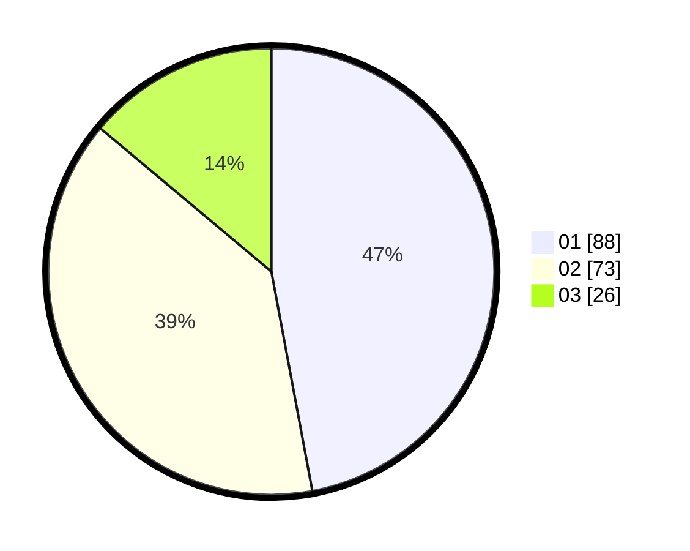

# Hasil

Hasil perolehan suara paslon dapat dilihat pada file paslon-01.txt, paslon-02.txt, dan paslon-03.txt.

Jika tidak ada, artinya data tersebut belum ada pada SIREKAP.

## Perolehan Suara

 * Paslon 01: **88**.
 * Paslon 02: **73**.
 * Paslon 03: **26**.

## Foto C Plano

https://sirekap-obj-formc.kpu.go.id/92ad/pemilu/ppwp/31/73/06/10/03/3173061003019-20240214-195952--6e18778a-45af-42d4-99c0-05b125920fbc.jpg

https://sirekap-obj-formc.kpu.go.id/92ad/pemilu/ppwp/31/73/06/10/03/3173061003019-20240214-194511--a89537b8-d4bf-488b-8af6-1268ab293288.jpg

https://sirekap-obj-formc.kpu.go.id/92ad/pemilu/ppwp/31/73/06/10/03/3173061003019-20240214-211102--cf9259c9-fc27-4260-9758-7d9bcbaae18a.jpg
