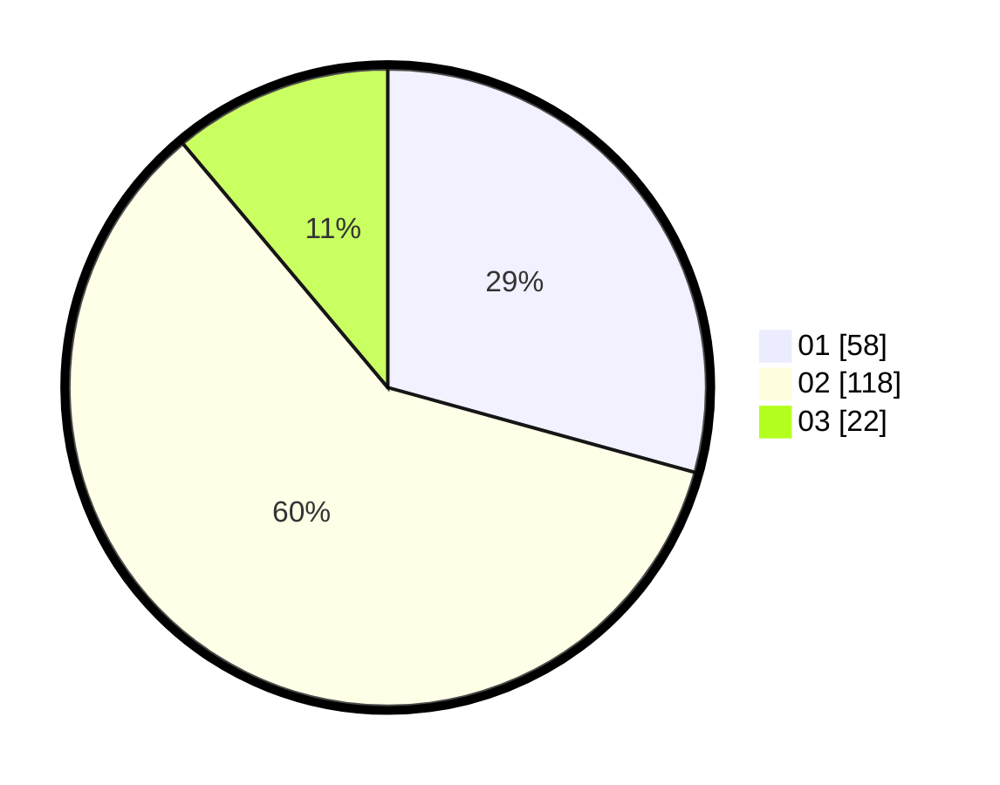

# Hasil

Hasil perolehan suara paslon dapat dilihat pada file paslon-01.txt, paslon-02.txt, dan paslon-03.txt.

Jika tidak ada, artinya data tersebut belum ada pada SIREKAP.

## Perolehan Suara

 * Paslon 01: **58**.
 * Paslon 02: **118**.
 * Paslon 03: **22**.

## Foto C Plano

https://sirekap-obj-formc.kpu.go.id/b0b7/pemilu/ppwp/31/73/06/10/03/3173061003020-20240214-193411--9c51dc6e-1705-4b48-b382-65f738bbef1e.jpg

https://sirekap-obj-formc.kpu.go.id/b0b7/pemilu/ppwp/31/73/06/10/03/3173061003020-20240214-193426--f5ad58dd-dfd4-4334-8c33-7bec35a48a94.jpg

https://sirekap-obj-formc.kpu.go.id/b0b7/pemilu/ppwp/31/73/06/10/03/3173061003020-20240214-193442--18c70a0d-f770-4f9e-8f22-6d39de40eb02.jpg

## DATA PEMILIH TETAP

Jumlah pemilih dalam DPT: **250**.
 * L: **129**.
 * P: **121**.

## DATA PENGGUNA HAK PILIH

Jumlah pengguna hak pilih dalam DPT: **196**.
 * L: **101**.
 * P: **95**.

Jumlah pengguna hak pilih dalam DPTb: **0**.
 * L: **0**.
 * P: **0**.

Jumlah pengguna hak pilih dalam DPK: **5**.
 * L: **4**.
 * P: **1**.

Jumlah pengguna hak pilih: **201**.
 * L: **105**.
 * P: **96**.

## JUMLAH SUARA SAH DAN TIDAK SAH

JUMLAH SELURUH SUARA SAH: **198**.

JUMLAH SUARA TIDAK SAH: **3**.

JUMLAH SELURUH SUARA SAH DAN SUARA TIDAK SAH: **201**.
