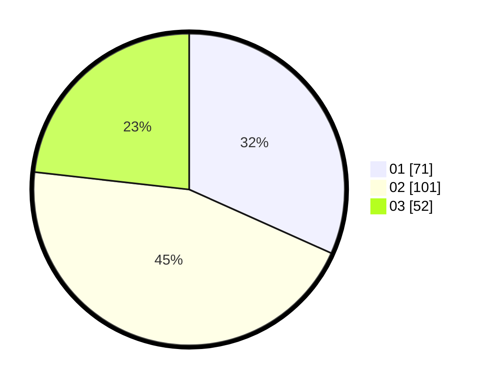

# Hasil

Hasil perolehan suara paslon dapat dilihat pada file paslon-01.txt, paslon-02.txt, dan paslon-03.txt.

Jika tidak ada, artinya data tersebut belum ada pada SIREKAP.

## Perolehan Suara

 * Paslon 01: **71**.
 * Paslon 02: **101**.
 * Paslon 03: **52**.

## Foto C Plano

https://sirekap-obj-formc.kpu.go.id/119a/pemilu/ppwp/31/73/06/10/03/3173061003022-20240214-215010--b3acbfd0-afc0-4aa2-a811-e005f4c7659f.jpg

https://sirekap-obj-formc.kpu.go.id/119a/pemilu/ppwp/31/73/06/10/03/3173061003022-20240214-215113--73bab36d-a6ed-4ebd-bf2e-83e88b02b7b1.jpg

https://sirekap-obj-formc.kpu.go.id/119a/pemilu/ppwp/31/73/06/10/03/3173061003022-20240214-215158--b7b81a78-967a-48ca-b4c8-dfb6fa70e490.jpg
