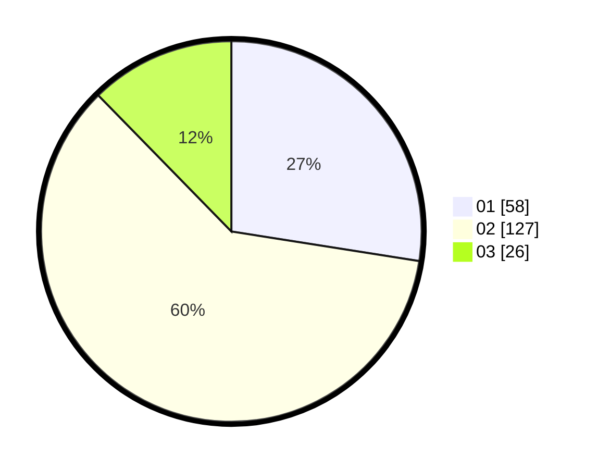

# Hasil

Hasil perolehan suara paslon dapat dilihat pada file paslon-01.txt, paslon-02.txt, dan paslon-03.txt.

Jika tidak ada, artinya data tersebut belum ada pada SIREKAP.

## Perolehan Suara

 * Paslon 01: **58**.
 * Paslon 02: **127**.
 * Paslon 03: **26**.

## Foto C Plano

https://sirekap-obj-formc.kpu.go.id/347f/pemilu/ppwp/31/73/06/10/03/3173061003027-20240216-071357--d9e0b441-f638-4158-b987-2e6b2762069c.jpg

https://sirekap-obj-formc.kpu.go.id/347f/pemilu/ppwp/31/73/06/10/03/3173061003027-20240216-071358--9cde3f94-89af-4b5e-a5fd-f543d4fd7b71.jpg

https://sirekap-obj-formc.kpu.go.id/347f/pemilu/ppwp/31/73/06/10/03/3173061003027-20240216-071358--cb895820-d910-4e7b-bd4c-88649d3e4715.jpg

## DATA PEMILIH TETAP

Jumlah pemilih dalam DPT: **0**.
 * L: **0**.
 * P: **0**.

## DATA PENGGUNA HAK PILIH

Jumlah pengguna hak pilih dalam DPT: **0**.
 * L: **0**.
 * P: **0**.

Jumlah pengguna hak pilih dalam DPTb: **0**.
 * L: **0**.
 * P: **0**.

Jumlah pengguna hak pilih dalam DPK: **0**.
 * L: **0**.
 * P: **0**.

Jumlah pengguna hak pilih: **0**.
 * L: **0**.
 * P: **0**.

## JUMLAH SUARA SAH DAN TIDAK SAH

JUMLAH SELURUH SUARA SAH: **211**.

JUMLAH SUARA TIDAK SAH: **2**.

JUMLAH SELURUH SUARA SAH DAN SUARA TIDAK SAH: **213**.
