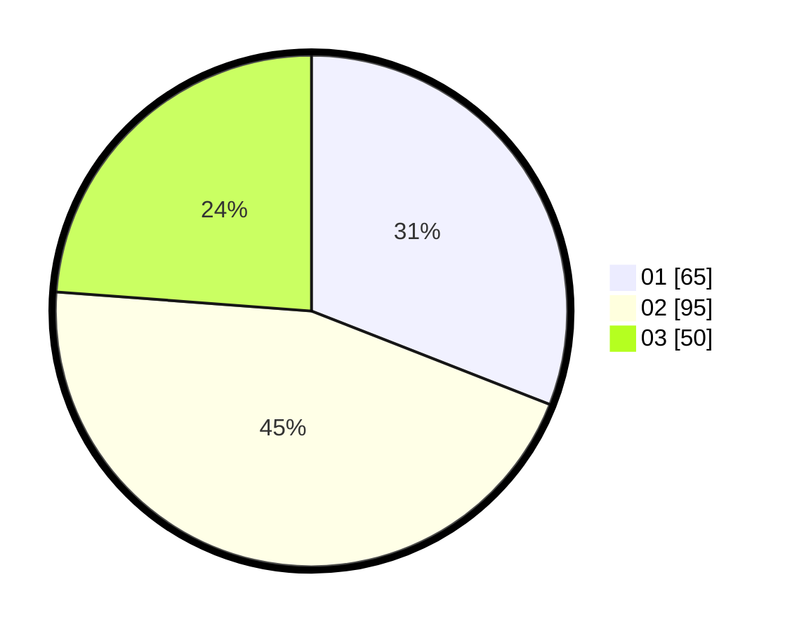

# Hasil

Hasil perolehan suara paslon dapat dilihat pada file paslon-01.txt, paslon-02.txt, dan paslon-03.txt.

Jika tidak ada, artinya data tersebut belum ada pada SIREKAP.

## Perolehan Suara

 * Paslon 01: **65**.
 * Paslon 02: **95**.
 * Paslon 03: **50**.

## Foto C Plano

https://sirekap-obj-formc.kpu.go.id/e8a8/pemilu/ppwp/31/73/06/10/03/3173061003029-20240216-150611--ac09eb70-85d4-4048-8e2c-c59163039a22.jpg

https://sirekap-obj-formc.kpu.go.id/e8a8/pemilu/ppwp/31/73/06/10/03/3173061003029-20240216-150613--544ac72c-9a7d-4dfc-82ae-d31b67da8b50.jpg

https://sirekap-obj-formc.kpu.go.id/e8a8/pemilu/ppwp/31/73/06/10/03/3173061003029-20240216-150612--c7bd8f30-147f-40a0-b8cb-d95752262fe2.jpg

## DATA PEMILIH TETAP

Jumlah pemilih dalam DPT: **297**.
 * L: **155**.
 * P: **142**.

## DATA PENGGUNA HAK PILIH

Jumlah pengguna hak pilih dalam DPT: **212**.
 * L: **106**.
 * P: **106**.

Jumlah pengguna hak pilih dalam DPTb: **0**.
 * L: **0**.
 * P: **0**.

Jumlah pengguna hak pilih dalam DPK: **3**.
 * L: **2**.
 * P: **1**.

Jumlah pengguna hak pilih: **215**.
 * L: **108**.
 * P: **107**.

## JUMLAH SUARA SAH DAN TIDAK SAH

JUMLAH SELURUH SUARA SAH: **210**.

JUMLAH SUARA TIDAK SAH: **5**.

JUMLAH SELURUH SUARA SAH DAN SUARA TIDAK SAH: **215**.
