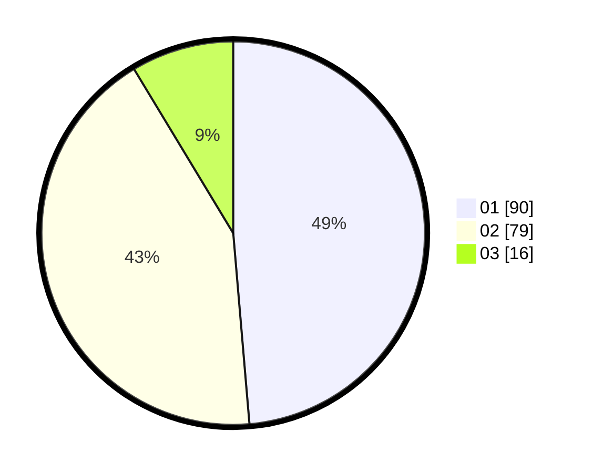

# Hasil

Hasil perolehan suara paslon dapat dilihat pada file paslon-01.txt, paslon-02.txt, dan paslon-03.txt.

Jika tidak ada, artinya data tersebut belum ada pada SIREKAP.

## Perolehan Suara

 * Paslon 01: **90**.
 * Paslon 02: **79**.
 * Paslon 03: **16**.

## Foto C Plano

https://sirekap-obj-formc.kpu.go.id/fe51/pemilu/ppwp/31/73/06/10/03/3173061003035-20240215-011318--58a8dfcf-1a65-4a20-a16f-872b76d9c92e.jpg

https://sirekap-obj-formc.kpu.go.id/fe51/pemilu/ppwp/31/73/06/10/03/3173061003035-20240215-011223--e5a51fda-6ed8-458e-a2e6-4d14ba889f83.jpg

https://sirekap-obj-formc.kpu.go.id/fe51/pemilu/ppwp/31/73/06/10/03/3173061003035-20240215-011410--47dabfbf-8fa9-46b2-8c27-c664d1dce43e.jpg
