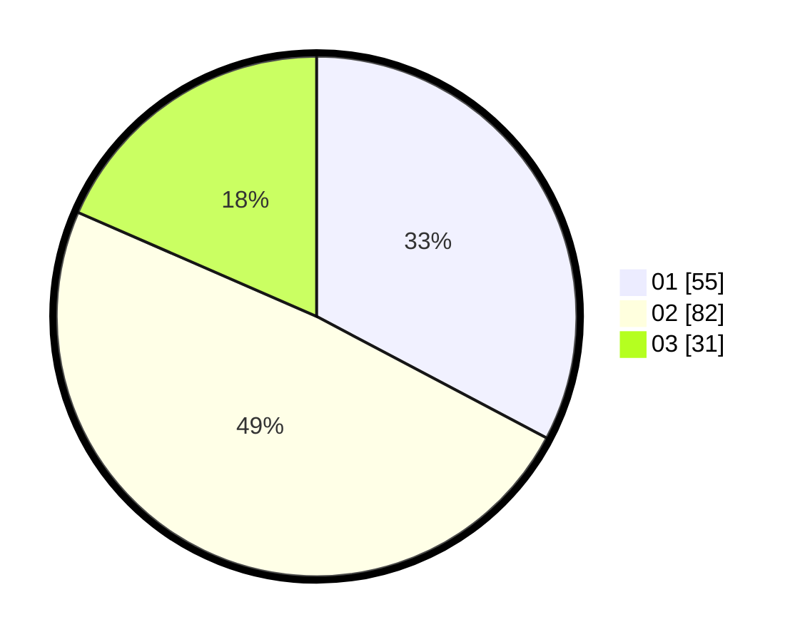

# Hasil

Hasil perolehan suara paslon dapat dilihat pada file paslon-01.txt, paslon-02.txt, dan paslon-03.txt.

Jika tidak ada, artinya data tersebut belum ada pada SIREKAP.

## Perolehan Suara

 * Paslon 01: **55**.
 * Paslon 02: **82**.
 * Paslon 03: **31**.

## Foto C Plano

https://sirekap-obj-formc.kpu.go.id/1a2c/pemilu/ppwp/31/73/06/10/03/3173061003036-20240214-221124--e4be82f3-f7ee-4702-9c6e-0ce89977a4ce.jpg

https://sirekap-obj-formc.kpu.go.id/1a2c/pemilu/ppwp/31/73/06/10/03/3173061003036-20240214-141210--8d9721c1-e44b-4438-879a-14df8d914e7c.jpg

https://sirekap-obj-formc.kpu.go.id/1a2c/pemilu/ppwp/31/73/06/10/03/3173061003036-20240214-141411--ad71ce32-db71-4c3e-8118-9bfe95d847da.jpg
