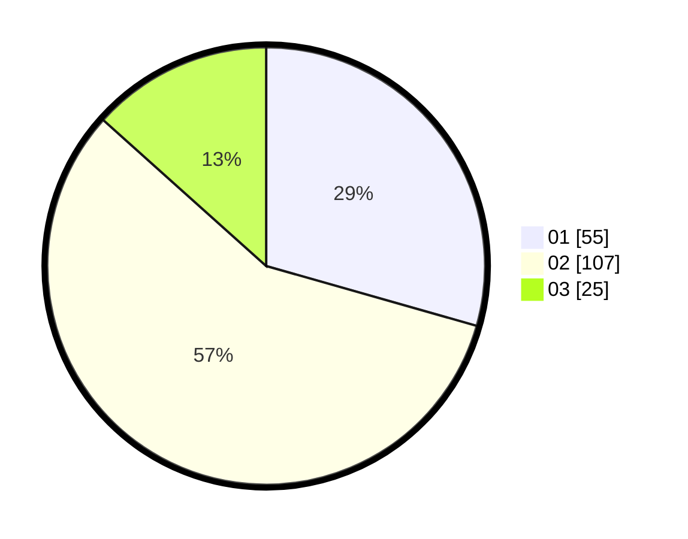

# Hasil

Hasil perolehan suara paslon dapat dilihat pada file paslon-01.txt, paslon-02.txt, dan paslon-03.txt.

Jika tidak ada, artinya data tersebut belum ada pada SIREKAP.

## Perolehan Suara

 * Paslon 01: **55**.
 * Paslon 02: **107**.
 * Paslon 03: **25**.

## Foto C Plano

https://sirekap-obj-formc.kpu.go.id/e7b4/pemilu/ppwp/31/73/06/10/03/3173061003039-20240216-021615--e0252df6-8f99-4479-bf74-ba964ab4f02b.jpg

https://sirekap-obj-formc.kpu.go.id/e7b4/pemilu/ppwp/31/73/06/10/03/3173061003039-20240216-021628--310fc429-ff2a-4b9b-933e-8c8f33bced6b.jpg

https://sirekap-obj-formc.kpu.go.id/e7b4/pemilu/ppwp/31/73/06/10/03/3173061003039-20240216-021622--8ea4079a-700b-43fb-9959-90c76d3bcd4a.jpg

## DATA PEMILIH TETAP

Jumlah pemilih dalam DPT: **263**.
 * L: **135**.
 * P: **128**.

## DATA PENGGUNA HAK PILIH

Jumlah pengguna hak pilih dalam DPT: **190**.
 * L: **91**.
 * P: **99**.

Jumlah pengguna hak pilih dalam DPTb: **0**.
 * L: **0**.
 * P: **0**.

Jumlah pengguna hak pilih dalam DPK: **0**.
 * L: **0**.
 * P: **0**.

Jumlah pengguna hak pilih: **190**.
 * L: **91**.
 * P: **99**.

## JUMLAH SUARA SAH DAN TIDAK SAH

JUMLAH SELURUH SUARA SAH: **187**.

JUMLAH SUARA TIDAK SAH: **3**.

JUMLAH SELURUH SUARA SAH DAN SUARA TIDAK SAH: **190**.
