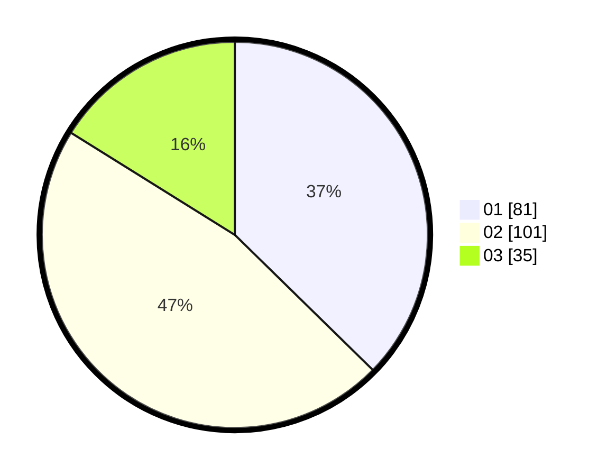

# Hasil

Hasil perolehan suara paslon dapat dilihat pada file paslon-01.txt, paslon-02.txt, dan paslon-03.txt.

Jika tidak ada, artinya data tersebut belum ada pada SIREKAP.

## Perolehan Suara

 * Paslon 01: **81**.
 * Paslon 02: **101**.
 * Paslon 03: **35**.

## Foto C Plano

https://sirekap-obj-formc.kpu.go.id/d1c7/pemilu/ppwp/31/73/06/10/03/3173061003041-20240216-133914--2e9bb2d3-5368-48d3-a44b-7b09a9640c16.jpg

https://sirekap-obj-formc.kpu.go.id/d1c7/pemilu/ppwp/31/73/06/10/03/3173061003041-20240216-133916--18602d72-bd7e-40aa-8879-000ed57a1d5c.jpg

https://sirekap-obj-formc.kpu.go.id/d1c7/pemilu/ppwp/31/73/06/10/03/3173061003041-20240216-133915--f97a3d5c-e86b-4d36-bc17-9a36cf6a3cdf.jpg

## DATA PEMILIH TETAP

Jumlah pemilih dalam DPT: **271**.
 * L: **133**.
 * P: **138**.

## DATA PENGGUNA HAK PILIH

Jumlah pengguna hak pilih dalam DPT: **221**.
 * L: **104**.
 * P: **117**.

Jumlah pengguna hak pilih dalam DPTb: **0**.
 * L: **0**.
 * P: **0**.

Jumlah pengguna hak pilih dalam DPK: **1**.
 * L: **1**.
 * P: **0**.

Jumlah pengguna hak pilih: **222**.
 * L: **105**.
 * P: **117**.

## JUMLAH SUARA SAH DAN TIDAK SAH

JUMLAH SELURUH SUARA SAH: **217**.

JUMLAH SUARA TIDAK SAH: **5**.

JUMLAH SELURUH SUARA SAH DAN SUARA TIDAK SAH: **222**.
