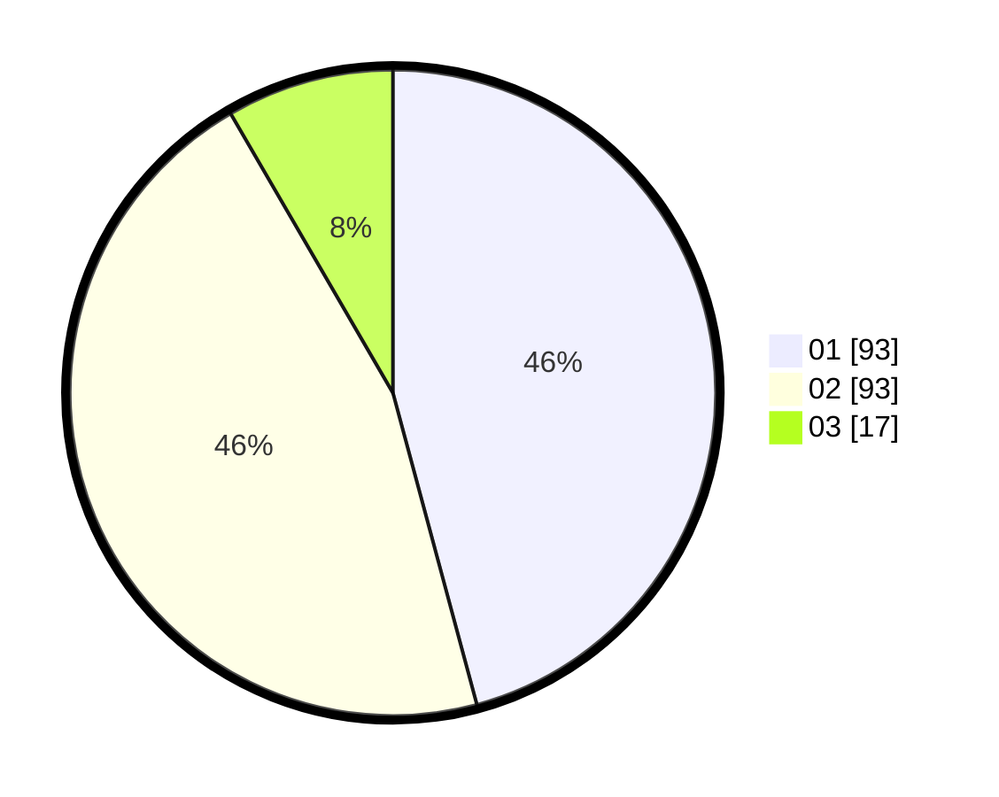

# Hasil

Hasil perolehan suara paslon dapat dilihat pada file paslon-01.txt, paslon-02.txt, dan paslon-03.txt.

Jika tidak ada, artinya data tersebut belum ada pada SIREKAP.

## Perolehan Suara

 * Paslon 01: **93**.
 * Paslon 02: **93**.
 * Paslon 03: **17**.

## Foto C Plano

https://sirekap-obj-formc.kpu.go.id/e053/pemilu/ppwp/31/73/06/10/03/3173061003042-20240214-202352--2db8b895-102d-4287-b88b-cd0586865362.jpg

https://sirekap-obj-formc.kpu.go.id/e053/pemilu/ppwp/31/73/06/10/03/3173061003042-20240214-201715--835b29c7-4b37-4d9d-a263-d377fbe23926.jpg

https://sirekap-obj-formc.kpu.go.id/e053/pemilu/ppwp/31/73/06/10/03/3173061003042-20240214-202226--cab5efcc-71b8-4891-9eb7-c6586fcd2166.jpg
