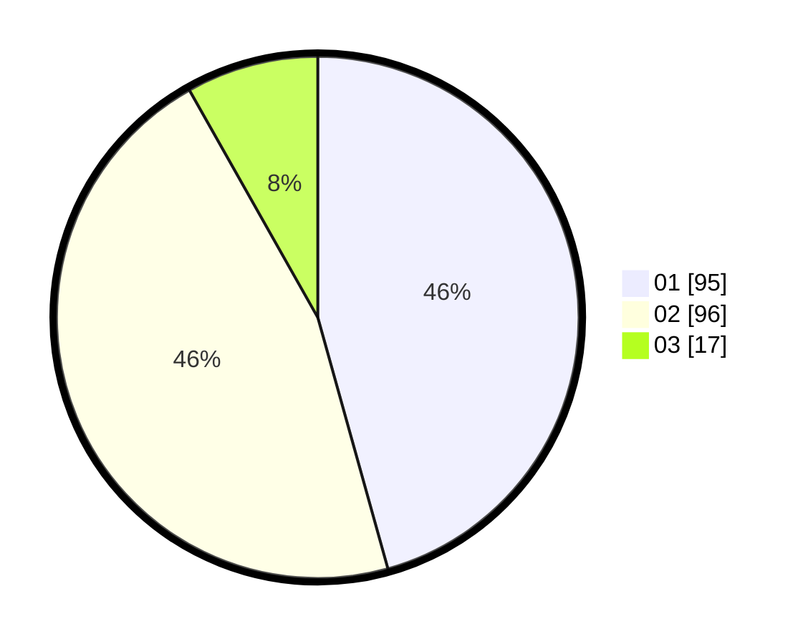

# Hasil

Hasil perolehan suara paslon dapat dilihat pada file paslon-01.txt, paslon-02.txt, dan paslon-03.txt.

Jika tidak ada, artinya data tersebut belum ada pada SIREKAP.

## Perolehan Suara

 * Paslon 01: **95**.
 * Paslon 02: **96**.
 * Paslon 03: **17**.

## Foto C Plano

https://sirekap-obj-formc.kpu.go.id/00cd/pemilu/ppwp/31/73/06/10/03/3173061003043-20240214-214659--113929dd-cd1d-48c8-b628-54db0a2fec1f.jpg

https://sirekap-obj-formc.kpu.go.id/00cd/pemilu/ppwp/31/73/06/10/03/3173061003043-20240214-214924--a7902e40-3f53-447f-b014-0aaaaab3be18.jpg

https://sirekap-obj-formc.kpu.go.id/00cd/pemilu/ppwp/31/73/06/10/03/3173061003043-20240214-215044--76d89a94-51ab-499c-8973-d3321d54f48f.jpg
