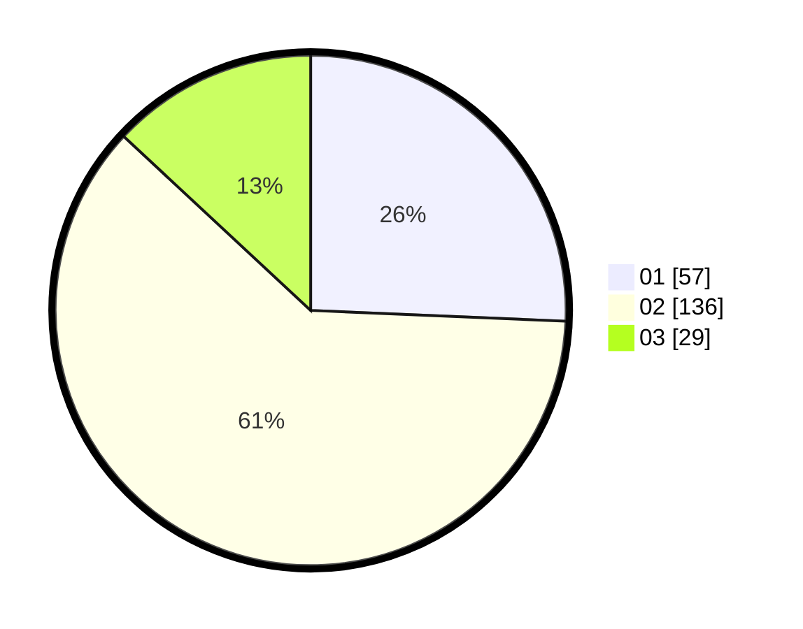

# Hasil

Hasil perolehan suara paslon dapat dilihat pada file paslon-01.txt, paslon-02.txt, dan paslon-03.txt.

Jika tidak ada, artinya data tersebut belum ada pada SIREKAP.

## Perolehan Suara

 * Paslon 01: **57**.
 * Paslon 02: **136**.
 * Paslon 03: **29**.

## Foto C Plano

https://sirekap-obj-formc.kpu.go.id/cd71/pemilu/ppwp/31/73/06/10/03/3173061003045-20240215-030044--84074053-388f-48a6-8dfd-fb97a3c9555a.jpg

https://sirekap-obj-formc.kpu.go.id/cd71/pemilu/ppwp/31/73/06/10/03/3173061003045-20240214-223052--cbb3d85f-fa47-4c7f-8de0-637b439e1290.jpg

https://sirekap-obj-formc.kpu.go.id/cd71/pemilu/ppwp/31/73/06/10/03/3173061003045-20240214-223219--e3aa85d6-8496-4715-9a79-3db69ea29175.jpg
