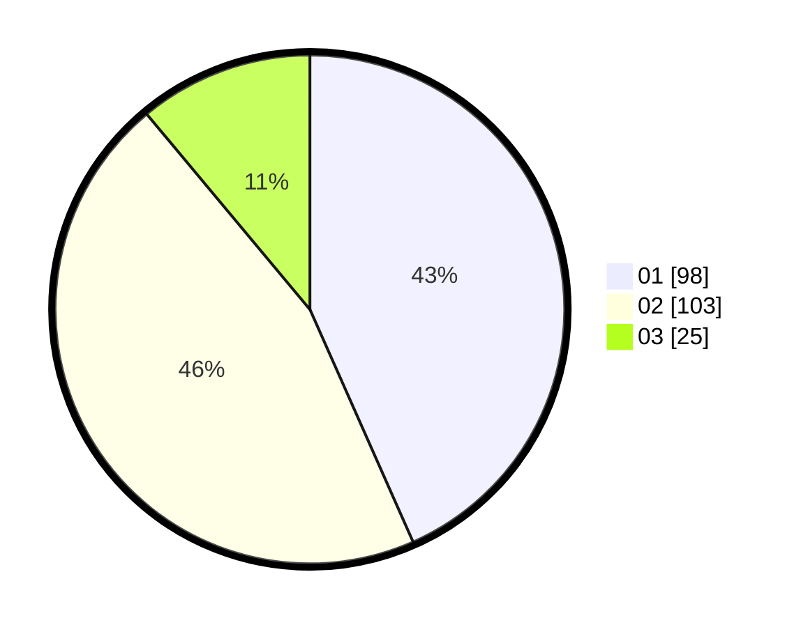

# Hasil

Hasil perolehan suara paslon dapat dilihat pada file paslon-01.txt, paslon-02.txt, dan paslon-03.txt.

Jika tidak ada, artinya data tersebut belum ada pada SIREKAP.

## Perolehan Suara

 * Paslon 01: **98**.
 * Paslon 02: **103**.
 * Paslon 03: **25**.

## Foto C Plano

https://sirekap-obj-formc.kpu.go.id/6084/pemilu/ppwp/31/73/06/10/03/3173061003047-20240214-193011--8f8367ef-cf73-4c97-99ef-25aa88cada98.jpg

https://sirekap-obj-formc.kpu.go.id/6084/pemilu/ppwp/31/73/06/10/03/3173061003047-20240214-192316--13bd2066-e6d6-4153-98d6-512d8ef8d65f.jpg

https://sirekap-obj-formc.kpu.go.id/6084/pemilu/ppwp/31/73/06/10/03/3173061003047-20240214-193202--f8ec9372-3ec4-4472-8ecd-16240a89efb3.jpg

## DATA PEMILIH TETAP

Jumlah pemilih dalam DPT: **262**.
 * L: **126**.
 * P: **136**.

## DATA PENGGUNA HAK PILIH

Jumlah pengguna hak pilih dalam DPT: **225**.
 * L: **106**.
 * P: **119**.

Jumlah pengguna hak pilih dalam DPTb: **0**.
 * L: **0**.
 * P: **0**.

Jumlah pengguna hak pilih dalam DPK: **4**.
 * L: **2**.
 * P: **2**.

Jumlah pengguna hak pilih: **229**.
 * L: **108**.
 * P: **121**.

## JUMLAH SUARA SAH DAN TIDAK SAH

JUMLAH SELURUH SUARA SAH: **226**.

JUMLAH SUARA TIDAK SAH: **3**.

JUMLAH SELURUH SUARA SAH DAN SUARA TIDAK SAH: **229**.
