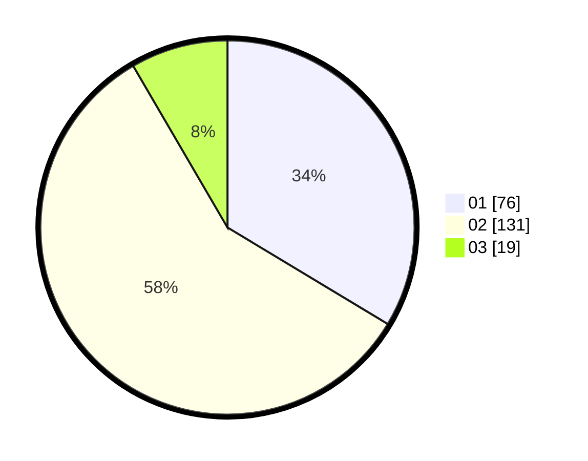

# Hasil

Hasil perolehan suara paslon dapat dilihat pada file paslon-01.txt, paslon-02.txt, dan paslon-03.txt.

Jika tidak ada, artinya data tersebut belum ada pada SIREKAP.

## Perolehan Suara

 * Paslon 01: **76**.
 * Paslon 02: **131**.
 * Paslon 03: **19**.

## Foto C Plano

https://sirekap-obj-formc.kpu.go.id/90a4/pemilu/ppwp/31/73/06/10/03/3173061003048-20240214-205214--11e1b412-b562-4820-b9f0-354e216ec107.jpg

https://sirekap-obj-formc.kpu.go.id/90a4/pemilu/ppwp/31/73/06/10/03/3173061003048-20240214-205338--e591f465-4448-482c-8092-ffdeb27c8a1b.jpg

https://sirekap-obj-formc.kpu.go.id/90a4/pemilu/ppwp/31/73/06/10/03/3173061003048-20240214-205506--8ea73684-c608-458e-9f24-5f5cfdcf354c.jpg
