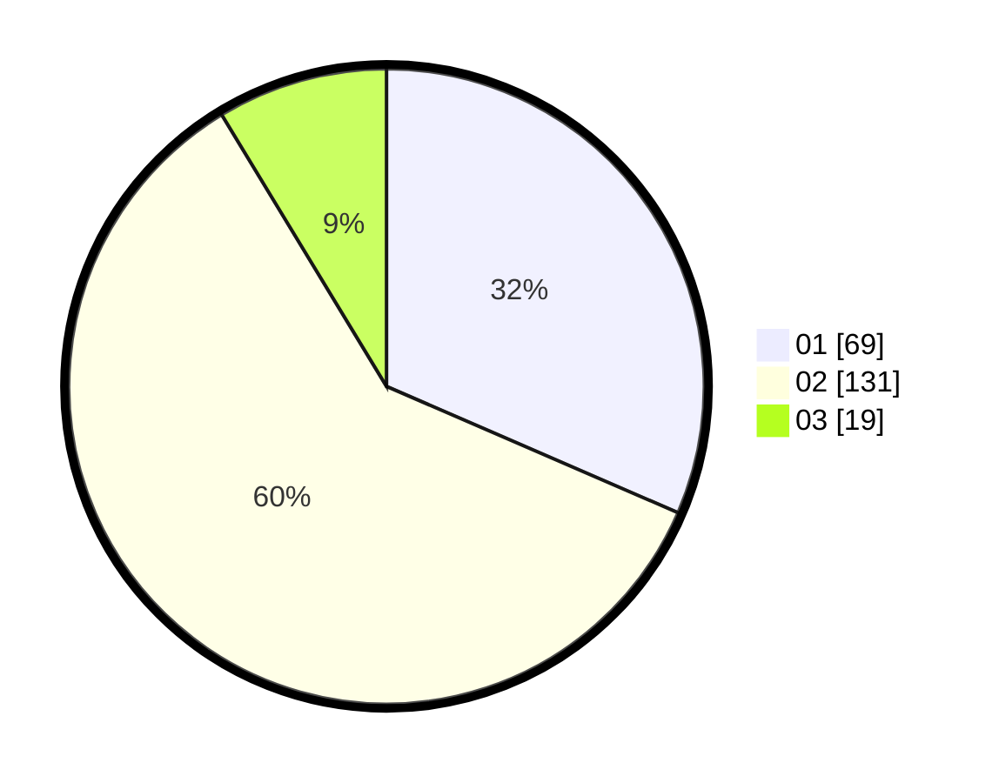

# Hasil

Hasil perolehan suara paslon dapat dilihat pada file paslon-01.txt, paslon-02.txt, dan paslon-03.txt.

Jika tidak ada, artinya data tersebut belum ada pada SIREKAP.

## Perolehan Suara

 * Paslon 01: **69**.
 * Paslon 02: **131**.
 * Paslon 03: **19**.

## Foto C Plano

https://sirekap-obj-formc.kpu.go.id/03be/pemilu/ppwp/31/73/06/10/03/3173061003052-20240214-225152--1090dcea-d120-4cf0-bb05-515dfe631a96.jpg

https://sirekap-obj-formc.kpu.go.id/03be/pemilu/ppwp/31/73/06/10/03/3173061003052-20240214-225221--9d2b5efd-2d39-4bcf-9f15-421f6b2ef071.jpg

https://sirekap-obj-formc.kpu.go.id/03be/pemilu/ppwp/31/73/06/10/03/3173061003052-20240214-225241--2c1b2d68-23f3-463e-bfc8-7d790e5ebeae.jpg
