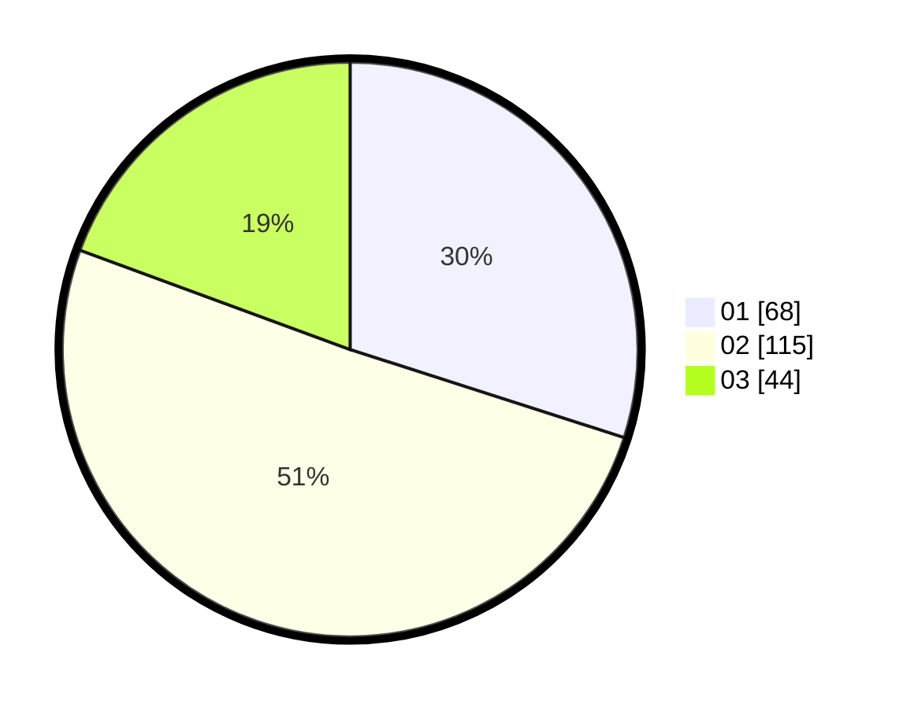

# Hasil

Hasil perolehan suara paslon dapat dilihat pada file paslon-01.txt, paslon-02.txt, dan paslon-03.txt.

Jika tidak ada, artinya data tersebut belum ada pada SIREKAP.

## Perolehan Suara

 * Paslon 01: **68**.
 * Paslon 02: **115**.
 * Paslon 03: **44**.

## Foto C Plano

https://sirekap-obj-formc.kpu.go.id/b1dd/pemilu/ppwp/31/73/06/10/03/3173061003054-20240216-070256--b346178e-b82b-4d52-9f48-1aed0263a9f4.jpg

https://sirekap-obj-formc.kpu.go.id/b1dd/pemilu/ppwp/31/73/06/10/03/3173061003054-20240216-070258--5c10486b-cd57-4c87-ac54-7e9abec85bb4.jpg

https://sirekap-obj-formc.kpu.go.id/b1dd/pemilu/ppwp/31/73/06/10/03/3173061003054-20240216-070257--c73474dc-a3a3-4034-a2e5-e17ebab903c6.jpg

## DATA PEMILIH TETAP

Jumlah pemilih dalam DPT: **297**.
 * L: **147**.
 * P: **150**.

## DATA PENGGUNA HAK PILIH

Jumlah pengguna hak pilih dalam DPT: **231**.
 * L: **113**.
 * P: **118**.

Jumlah pengguna hak pilih dalam DPTb: **0**.
 * L: **0**.
 * P: **0**.

Jumlah pengguna hak pilih dalam DPK: **0**.
 * L: **0**.
 * P: **0**.

Jumlah pengguna hak pilih: **231**.
 * L: **113**.
 * P: **118**.

## JUMLAH SUARA SAH DAN TIDAK SAH

JUMLAH SELURUH SUARA SAH: **227**.

JUMLAH SUARA TIDAK SAH: **4**.

JUMLAH SELURUH SUARA SAH DAN SUARA TIDAK SAH: **231**.
