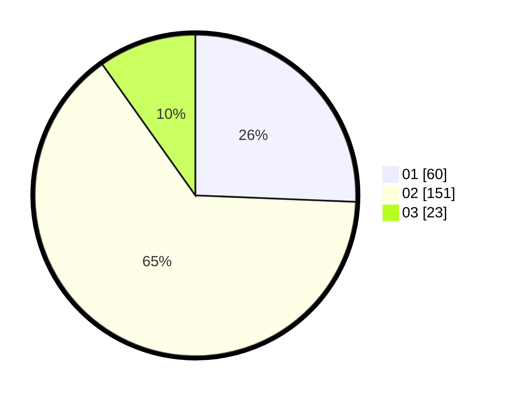

# Hasil

Hasil perolehan suara paslon dapat dilihat pada file paslon-01.txt, paslon-02.txt, dan paslon-03.txt.

Jika tidak ada, artinya data tersebut belum ada pada SIREKAP.

## Perolehan Suara

 * Paslon 01: **60**.
 * Paslon 02: **151**.
 * Paslon 03: **23**.

## Foto C Plano

https://sirekap-obj-formc.kpu.go.id/22da/pemilu/ppwp/31/73/06/10/03/3173061003055-20240216-052626--a96a9cdb-f894-4abb-9175-95298a4f32c3.jpg

https://sirekap-obj-formc.kpu.go.id/22da/pemilu/ppwp/31/73/06/10/03/3173061003055-20240216-052629--dd580264-9879-4245-a8ba-1f2d4b80df84.jpg

https://sirekap-obj-formc.kpu.go.id/22da/pemilu/ppwp/31/73/06/10/03/3173061003055-20240216-052628--e2133b2f-ea42-4cc6-8751-52c12ef0808c.jpg

## DATA PEMILIH TETAP

Jumlah pemilih dalam DPT: **294**.
 * L: **141**.
 * P: **153**.

## DATA PENGGUNA HAK PILIH

Jumlah pengguna hak pilih dalam DPT: **238**.
 * L: **114**.
 * P: **124**.

Jumlah pengguna hak pilih dalam DPTb: **0**.
 * L: **0**.
 * P: **0**.

Jumlah pengguna hak pilih dalam DPK: **0**.
 * L: **0**.
 * P: **0**.

Jumlah pengguna hak pilih: **238**.
 * L: **114**.
 * P: **124**.

## JUMLAH SUARA SAH DAN TIDAK SAH

JUMLAH SELURUH SUARA SAH: **234**.

JUMLAH SUARA TIDAK SAH: **4**.

JUMLAH SELURUH SUARA SAH DAN SUARA TIDAK SAH: **238**.
