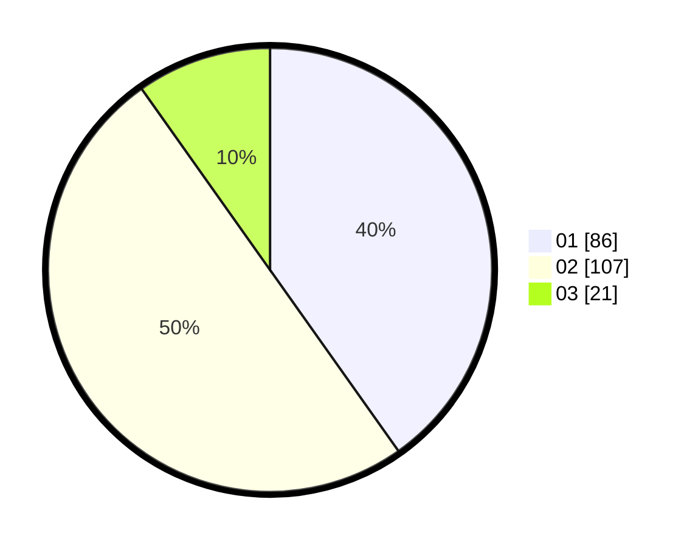

# Hasil

Hasil perolehan suara paslon dapat dilihat pada file paslon-01.txt, paslon-02.txt, dan paslon-03.txt.

Jika tidak ada, artinya data tersebut belum ada pada SIREKAP.

## Perolehan Suara

 * Paslon 01: **86**.
 * Paslon 02: **107**.
 * Paslon 03: **21**.

## Foto C Plano

https://sirekap-obj-formc.kpu.go.id/bde8/pemilu/ppwp/31/73/06/10/03/3173061003056-20240216-081709--365bfad5-54cf-459d-a978-44aebb06fab3.jpg

https://sirekap-obj-formc.kpu.go.id/bde8/pemilu/ppwp/31/73/06/10/03/3173061003056-20240216-081711--47a1e777-b1c8-4324-b961-8e23219615e3.jpg

https://sirekap-obj-formc.kpu.go.id/bde8/pemilu/ppwp/31/73/06/10/03/3173061003056-20240216-081710--79c45490-e58d-4033-943a-6a2108df6d29.jpg

## DATA PEMILIH TETAP

Jumlah pemilih dalam DPT: **296**.
 * L: **145**.
 * P: **151**.

## DATA PENGGUNA HAK PILIH

Jumlah pengguna hak pilih dalam DPT: **218**.
 * L: **103**.
 * P: **115**.

Jumlah pengguna hak pilih dalam DPTb: **0**.
 * L: **0**.
 * P: **0**.

Jumlah pengguna hak pilih dalam DPK: **0**.
 * L: **0**.
 * P: **0**.

Jumlah pengguna hak pilih: **218**.
 * L: **103**.
 * P: **115**.

## JUMLAH SUARA SAH DAN TIDAK SAH

JUMLAH SELURUH SUARA SAH: **214**.

JUMLAH SUARA TIDAK SAH: **4**.

JUMLAH SELURUH SUARA SAH DAN SUARA TIDAK SAH: **218**.
