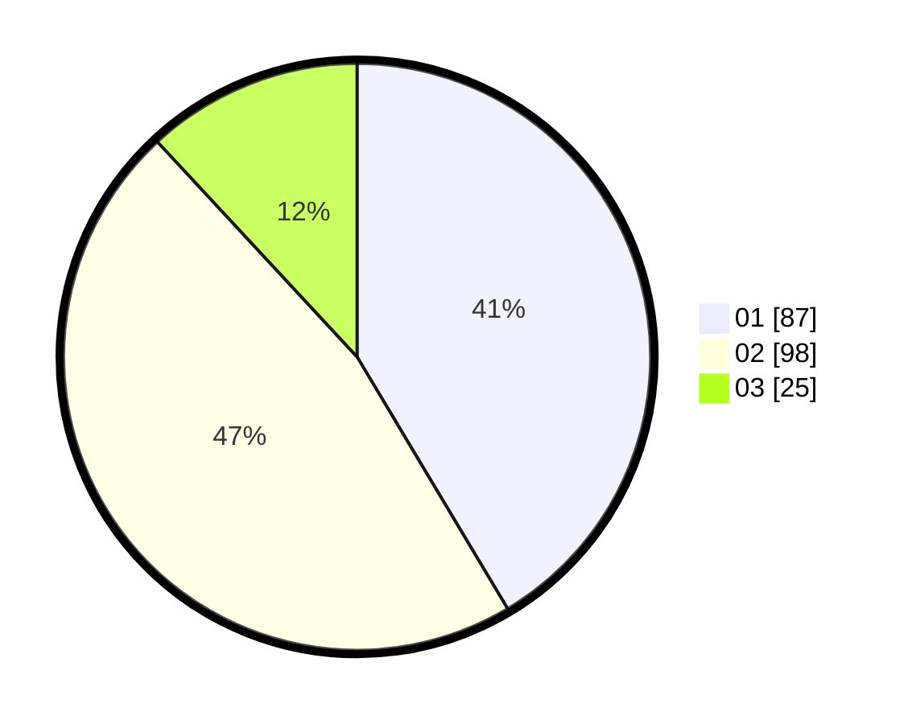

# Hasil

Hasil perolehan suara paslon dapat dilihat pada file paslon-01.txt, paslon-02.txt, dan paslon-03.txt.

Jika tidak ada, artinya data tersebut belum ada pada SIREKAP.

## Perolehan Suara

 * Paslon 01: **87**.
 * Paslon 02: **98**.
 * Paslon 03: **25**.

## Foto C Plano

https://sirekap-obj-formc.kpu.go.id/b2f4/pemilu/ppwp/31/73/06/10/03/3173061003060-20240214-220439--0897da17-5867-42d9-8501-96962a039448.jpg

https://sirekap-obj-formc.kpu.go.id/b2f4/pemilu/ppwp/31/73/06/10/03/3173061003060-20240214-220532--bd08a508-a9ea-4c33-bab8-bec0f759cd0b.jpg

https://sirekap-obj-formc.kpu.go.id/b2f4/pemilu/ppwp/31/73/06/10/03/3173061003060-20240214-220609--d1ff950e-0332-4a32-9d9d-6ca61ba48681.jpg
