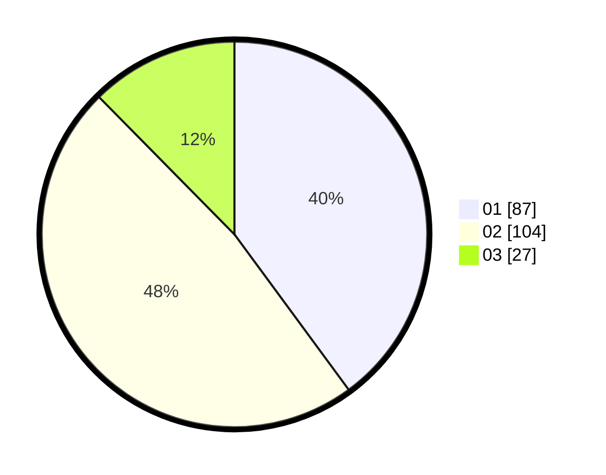

# Hasil

Hasil perolehan suara paslon dapat dilihat pada file paslon-01.txt, paslon-02.txt, dan paslon-03.txt.

Jika tidak ada, artinya data tersebut belum ada pada SIREKAP.

## Perolehan Suara

 * Paslon 01: **87**.
 * Paslon 02: **104**.
 * Paslon 03: **27**.

## Foto C Plano

https://sirekap-obj-formc.kpu.go.id/c322/pemilu/ppwp/31/73/06/10/03/3173061003065-20240214-140951--5cacace0-c6db-4796-912b-d2e1680ab0d5.jpg

https://sirekap-obj-formc.kpu.go.id/c322/pemilu/ppwp/31/73/06/10/03/3173061003065-20240214-141042--33a83f51-fe26-4f90-adc2-7871034a0f7b.jpg

https://sirekap-obj-formc.kpu.go.id/c322/pemilu/ppwp/31/73/06/10/03/3173061003065-20240215-233055--67432d6f-c929-4248-8b6d-5ff60386a1fa.jpg

## DATA PEMILIH TETAP

Jumlah pemilih dalam DPT: **266**.
 * L: **137**.
 * P: **129**.

## DATA PENGGUNA HAK PILIH

Jumlah pengguna hak pilih dalam DPT: **221**.
 * L: **106**.
 * P: **115**.

Jumlah pengguna hak pilih dalam DPTb: **0**.
 * L: **0**.
 * P: **0**.

Jumlah pengguna hak pilih dalam DPK: **2**.
 * L: **1**.
 * P: **1**.

Jumlah pengguna hak pilih: **223**.
 * L: **107**.
 * P: **116**.

## JUMLAH SUARA SAH DAN TIDAK SAH

JUMLAH SELURUH SUARA SAH: **218**.

JUMLAH SUARA TIDAK SAH: **5**.

JUMLAH SELURUH SUARA SAH DAN SUARA TIDAK SAH: **223**.
