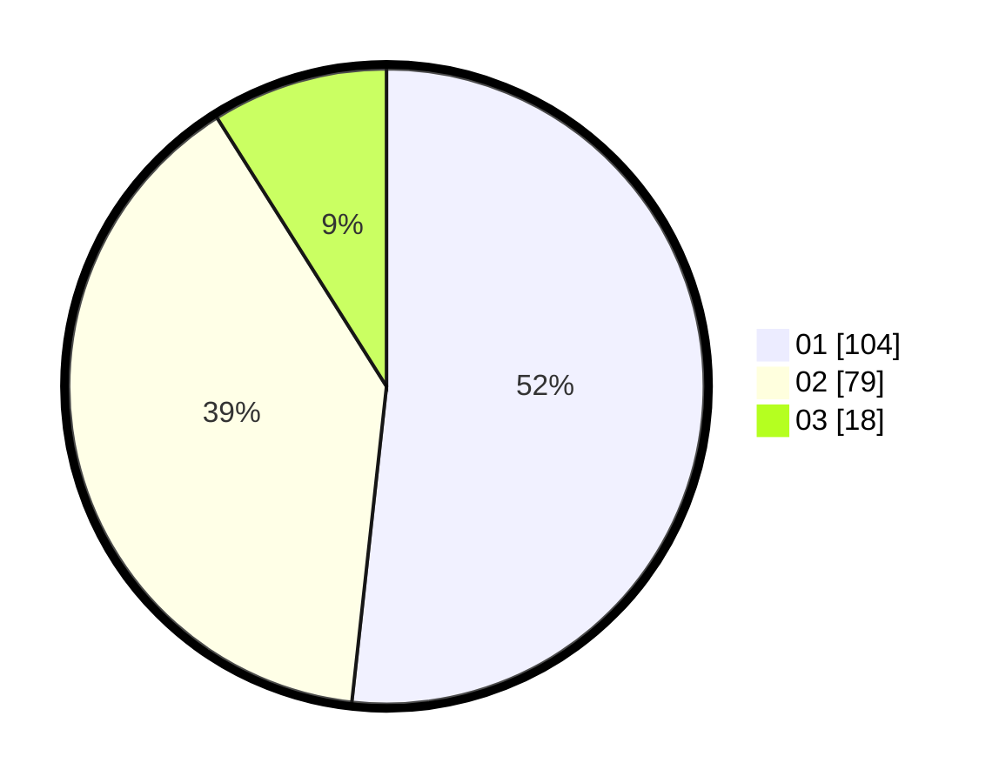

# Hasil

Hasil perolehan suara paslon dapat dilihat pada file paslon-01.txt, paslon-02.txt, dan paslon-03.txt.

Jika tidak ada, artinya data tersebut belum ada pada SIREKAP.

## Perolehan Suara

 * Paslon 01: **104**.
 * Paslon 02: **79**.
 * Paslon 03: **18**.

## Foto C Plano

https://sirekap-obj-formc.kpu.go.id/5bf6/pemilu/ppwp/31/73/06/10/03/3173061003068-20240216-220220--a71c17ca-c4e3-45f7-9c82-4dc2ef80d37f.jpg

https://sirekap-obj-formc.kpu.go.id/5bf6/pemilu/ppwp/31/73/06/10/03/3173061003068-20240216-220222--e3799949-4aa5-4a9c-8797-eb8b648fff75.jpg

https://sirekap-obj-formc.kpu.go.id/5bf6/pemilu/ppwp/31/73/06/10/03/3173061003068-20240216-220221--0a527b26-c8ff-40b3-ba4b-c4d3d019be88.jpg

## DATA PEMILIH TETAP

Jumlah pemilih dalam DPT: **266**.
 * L: **135**.
 * P: **131**.

## DATA PENGGUNA HAK PILIH

Jumlah pengguna hak pilih dalam DPT: **202**.
 * L: **99**.
 * P: **103**.

Jumlah pengguna hak pilih dalam DPTb: **0**.
 * L: **0**.
 * P: **0**.

Jumlah pengguna hak pilih dalam DPK: **0**.
 * L: **0**.
 * P: **0**.

Jumlah pengguna hak pilih: **202**.
 * L: **99**.
 * P: **103**.

## JUMLAH SUARA SAH DAN TIDAK SAH

JUMLAH SELURUH SUARA SAH: **201**.

JUMLAH SUARA TIDAK SAH: **1**.

JUMLAH SELURUH SUARA SAH DAN SUARA TIDAK SAH: **202**.
