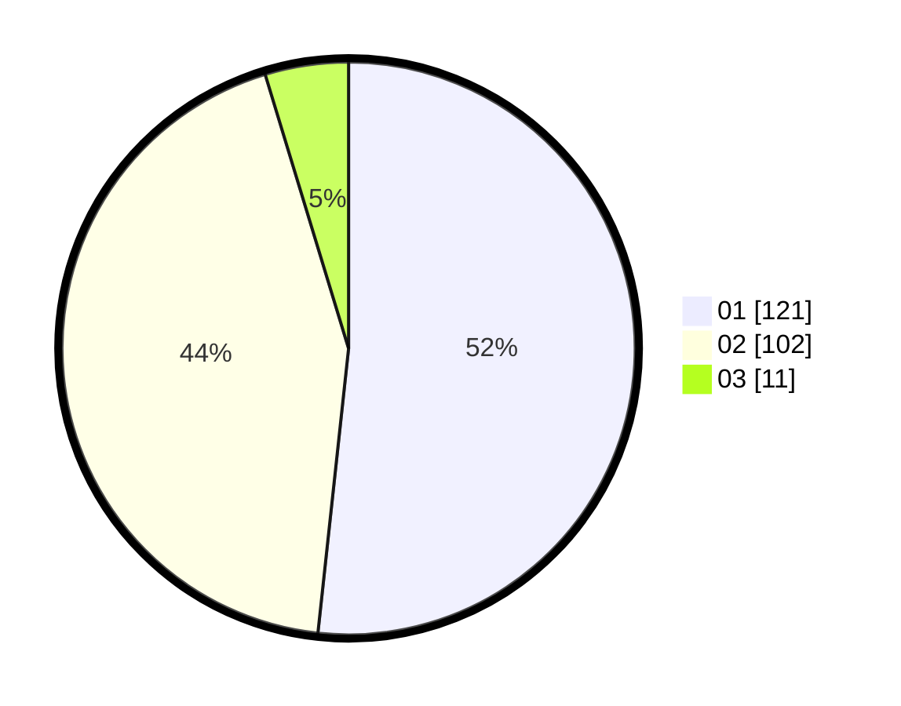

# Hasil

Hasil perolehan suara paslon dapat dilihat pada file paslon-01.txt, paslon-02.txt, dan paslon-03.txt.

Jika tidak ada, artinya data tersebut belum ada pada SIREKAP.

## Perolehan Suara

 * Paslon 01: **121**.
 * Paslon 02: **102**.
 * Paslon 03: **11**.

## Foto C Plano

https://sirekap-obj-formc.kpu.go.id/c542/pemilu/ppwp/31/73/06/10/03/3173061003069-20240216-093215--97629cae-ea4e-4f62-913b-af4fb078f206.jpg

https://sirekap-obj-formc.kpu.go.id/c542/pemilu/ppwp/31/73/06/10/03/3173061003069-20240216-093220--2c3f3745-7643-4ae5-8b32-c7262cb6d6f3.jpg

https://sirekap-obj-formc.kpu.go.id/c542/pemilu/ppwp/31/73/06/10/03/3173061003069-20240216-093218--1b1b0bc2-4ab2-47fd-b7db-09398cdc9d86.jpg

## DATA PEMILIH TETAP

Jumlah pemilih dalam DPT: **294**.
 * L: **154**.
 * P: **140**.

## DATA PENGGUNA HAK PILIH

Jumlah pengguna hak pilih dalam DPT: **237**.
 * L: **121**.
 * P: **116**.

Jumlah pengguna hak pilih dalam DPTb: **0**.
 * L: **0**.
 * P: **0**.

Jumlah pengguna hak pilih dalam DPK: **1**.
 * L: **0**.
 * P: **1**.

Jumlah pengguna hak pilih: **238**.
 * L: **121**.
 * P: **117**.

## JUMLAH SUARA SAH DAN TIDAK SAH

JUMLAH SELURUH SUARA SAH: **234**.

JUMLAH SUARA TIDAK SAH: **4**.

JUMLAH SELURUH SUARA SAH DAN SUARA TIDAK SAH: **238**.
