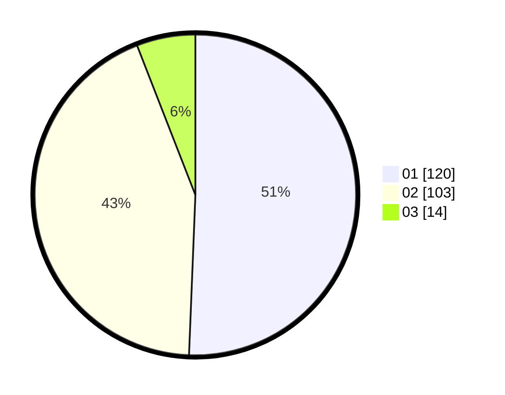

# Hasil

Hasil perolehan suara paslon dapat dilihat pada file paslon-01.txt, paslon-02.txt, dan paslon-03.txt.

Jika tidak ada, artinya data tersebut belum ada pada SIREKAP.

## Perolehan Suara

 * Paslon 01: **120**.
 * Paslon 02: **103**.
 * Paslon 03: **14**.

## Foto C Plano

https://sirekap-obj-formc.kpu.go.id/747a/pemilu/ppwp/31/73/06/10/03/3173061003070-20240215-232523--eb8081d8-66fc-4fd5-b438-214d20d7c650.jpg

https://sirekap-obj-formc.kpu.go.id/747a/pemilu/ppwp/31/73/06/10/03/3173061003070-20240214-192557--646e3882-95e5-4587-8fe0-2ce0da7c7a90.jpg

https://sirekap-obj-formc.kpu.go.id/747a/pemilu/ppwp/31/73/06/10/03/3173061003070-20240215-232524--a28b8fa7-8e6a-47d6-afdb-4ee84d5f0451.jpg

## DATA PEMILIH TETAP

Jumlah pemilih dalam DPT: **292**.
 * L: **142**.
 * P: **150**.

## DATA PENGGUNA HAK PILIH

Jumlah pengguna hak pilih dalam DPT: **241**.
 * L: **117**.
 * P: **124**.

Jumlah pengguna hak pilih dalam DPTb: **0**.
 * L: **0**.
 * P: **0**.

Jumlah pengguna hak pilih dalam DPK: **2**.
 * L: **0**.
 * P: **2**.

Jumlah pengguna hak pilih: **243**.
 * L: **117**.
 * P: **126**.

## JUMLAH SUARA SAH DAN TIDAK SAH

JUMLAH SELURUH SUARA SAH: **237**.

JUMLAH SUARA TIDAK SAH: **6**.

JUMLAH SELURUH SUARA SAH DAN SUARA TIDAK SAH: **243**.
