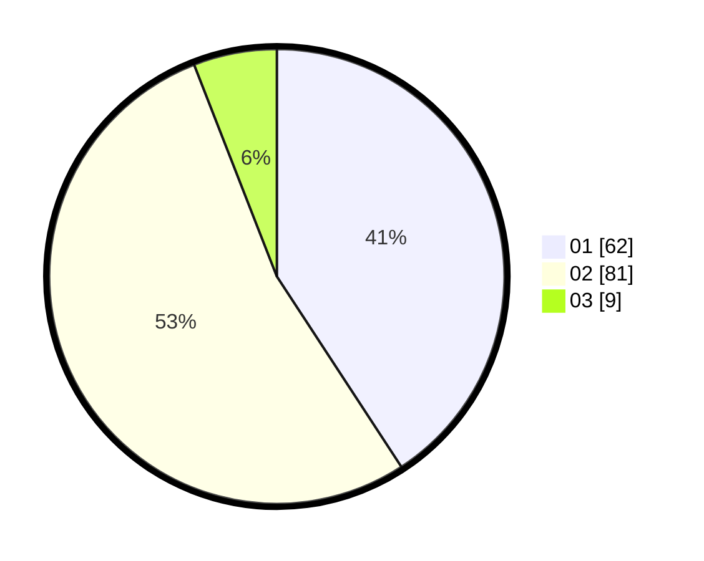

# Hasil

Hasil perolehan suara paslon dapat dilihat pada file paslon-01.txt, paslon-02.txt, dan paslon-03.txt.

Jika tidak ada, artinya data tersebut belum ada pada SIREKAP.

## Perolehan Suara

 * Paslon 01: **62**.
 * Paslon 02: **81**.
 * Paslon 03: **9**.

## Foto C Plano

https://sirekap-obj-formc.kpu.go.id/de4a/pemilu/ppwp/31/73/06/10/03/3173061003071-20240215-230840--5b3e92e9-44ff-4556-a6f1-cefeb3c2b032.jpg

https://sirekap-obj-formc.kpu.go.id/de4a/pemilu/ppwp/31/73/06/10/03/3173061003071-20240215-230842--6f7547a0-09a5-4e2a-a5d7-933fb072b590.jpg

https://sirekap-obj-formc.kpu.go.id/de4a/pemilu/ppwp/31/73/06/10/03/3173061003071-20240215-230841--8f8c17a9-a478-41e1-a62c-60e1d06d9c6c.jpg

## DATA PEMILIH TETAP

Jumlah pemilih dalam DPT: **219**.
 * L: **111**.
 * P: **108**.

## DATA PENGGUNA HAK PILIH

Jumlah pengguna hak pilih dalam DPT: **152**.
 * L: **73**.
 * P: **79**.

Jumlah pengguna hak pilih dalam DPTb: **0**.
 * L: **0**.
 * P: **0**.

Jumlah pengguna hak pilih dalam DPK: **2**.
 * L: **2**.
 * P: **0**.

Jumlah pengguna hak pilih: **154**.
 * L: **75**.
 * P: **79**.

## JUMLAH SUARA SAH DAN TIDAK SAH

JUMLAH SELURUH SUARA SAH: **152**.

JUMLAH SUARA TIDAK SAH: **2**.

JUMLAH SELURUH SUARA SAH DAN SUARA TIDAK SAH: **154**.
