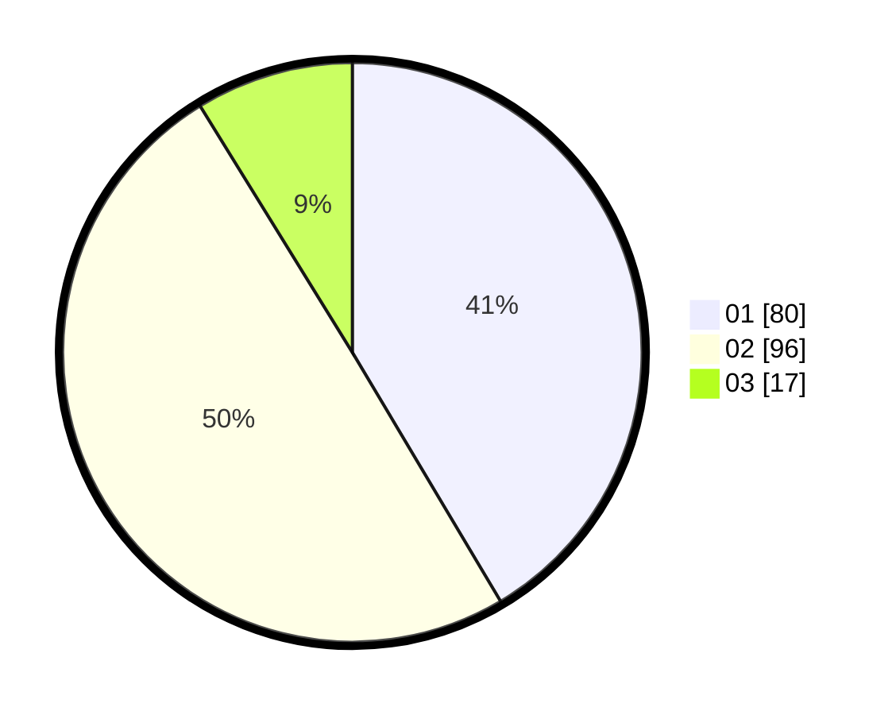

# Hasil

Hasil perolehan suara paslon dapat dilihat pada file paslon-01.txt, paslon-02.txt, dan paslon-03.txt.

Jika tidak ada, artinya data tersebut belum ada pada SIREKAP.

## Perolehan Suara

 * Paslon 01: **80**.
 * Paslon 02: **96**.
 * Paslon 03: **17**.

## Foto C Plano

https://sirekap-obj-formc.kpu.go.id/6028/pemilu/ppwp/31/73/06/10/03/3173061003075-20240215-003644--9770470a-3583-454b-9346-9883b8371e74.jpg

https://sirekap-obj-formc.kpu.go.id/6028/pemilu/ppwp/31/73/06/10/03/3173061003075-20240215-003757--66550df3-8f6c-4552-9b8a-b0fc81164deb.jpg

https://sirekap-obj-formc.kpu.go.id/6028/pemilu/ppwp/31/73/06/10/03/3173061003075-20240215-003849--b06c1599-27ca-4e3d-a1f3-1c88dcd40fb8.jpg
