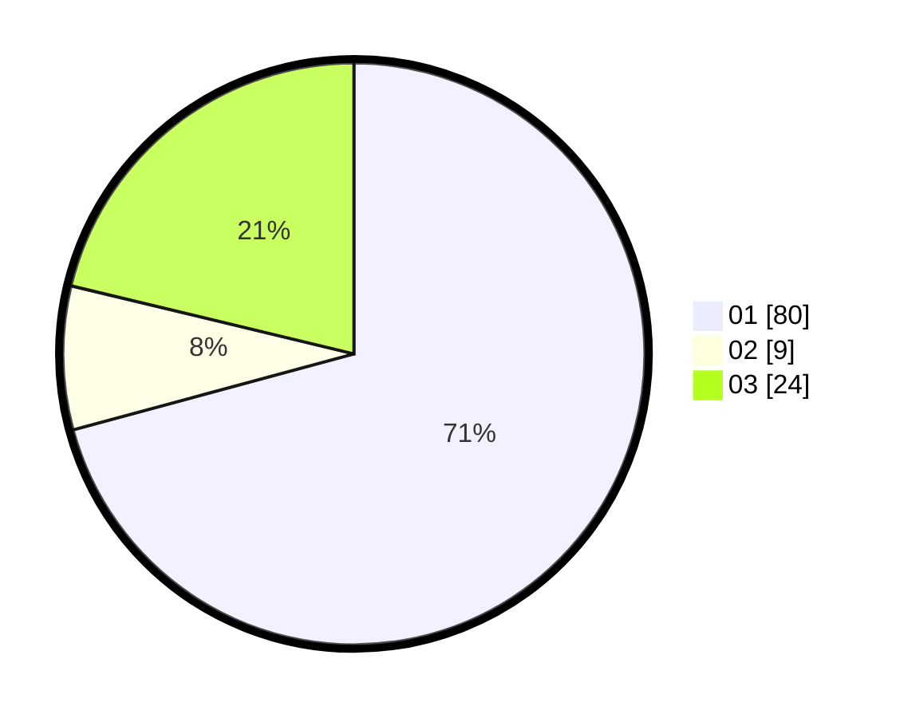

# Hasil

Hasil perolehan suara paslon dapat dilihat pada file paslon-01.txt, paslon-02.txt, dan paslon-03.txt.

Jika tidak ada, artinya data tersebut belum ada pada SIREKAP.

## Perolehan Suara

 * Paslon 01: **80**.
 * Paslon 02: **9**.
 * Paslon 03: **24**.

## Foto C Plano

https://sirekap-obj-formc.kpu.go.id/5c52/pemilu/ppwp/31/73/06/10/03/3173061003076-20240214-202815--51a2d49c-3655-4333-89af-b2f219c42c99.jpg

https://sirekap-obj-formc.kpu.go.id/5c52/pemilu/ppwp/31/73/06/10/03/3173061003076-20240214-203237--e1c8beb9-80c5-41f4-b6b8-c7a5f726acaf.jpg

https://sirekap-obj-formc.kpu.go.id/5c52/pemilu/ppwp/31/73/06/10/03/3173061003076-20240214-203401--bc63bfff-3680-4b04-9a5e-665ec153e48a.jpg
