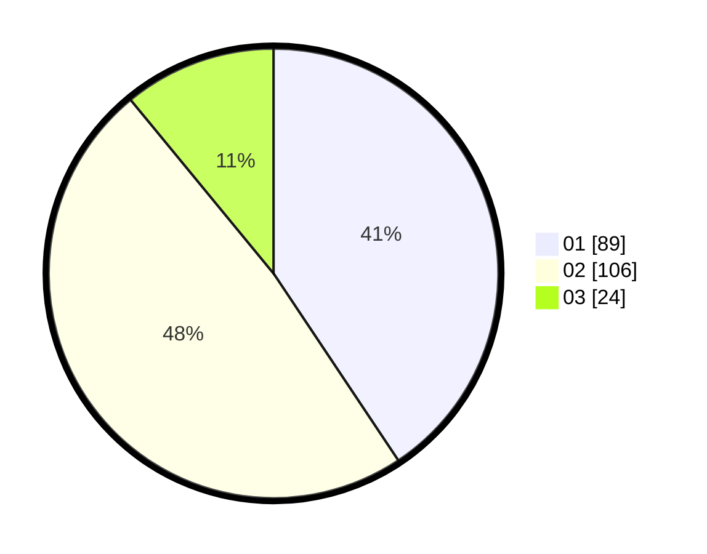

# Hasil

Hasil perolehan suara paslon dapat dilihat pada file paslon-01.txt, paslon-02.txt, dan paslon-03.txt.

Jika tidak ada, artinya data tersebut belum ada pada SIREKAP.

## Perolehan Suara

 * Paslon 01: **89**.
 * Paslon 02: **106**.
 * Paslon 03: **24**.

## Foto C Plano

https://sirekap-obj-formc.kpu.go.id/230f/pemilu/ppwp/31/73/06/10/03/3173061003079-20240214-190652--d30cbaa1-75ba-462a-be0e-e16a529df2e1.jpg

https://sirekap-obj-formc.kpu.go.id/230f/pemilu/ppwp/31/73/06/10/03/3173061003079-20240215-014717--0649fc9a-a5b1-4bff-a092-bd1ebc9b68eb.jpg

https://sirekap-obj-formc.kpu.go.id/230f/pemilu/ppwp/31/73/06/10/03/3173061003079-20240214-190840--505cef0f-6eaa-44ee-8e51-d9eedf9cfa0d.jpg
