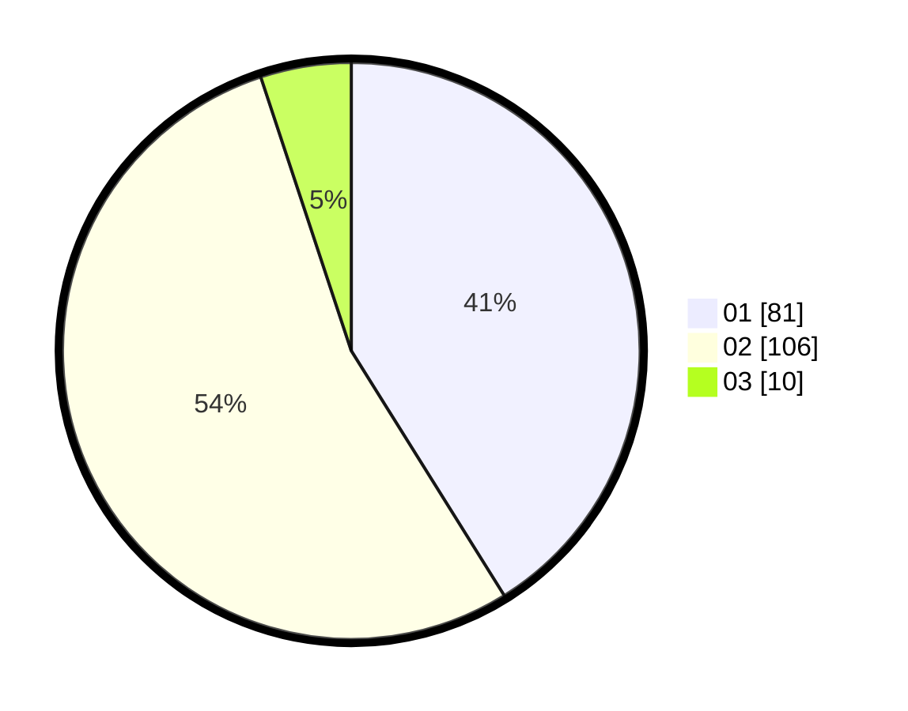

# Hasil

Hasil perolehan suara paslon dapat dilihat pada file paslon-01.txt, paslon-02.txt, dan paslon-03.txt.

Jika tidak ada, artinya data tersebut belum ada pada SIREKAP.

## Perolehan Suara

 * Paslon 01: **81**.
 * Paslon 02: **106**.
 * Paslon 03: **10**.

## Foto C Plano

https://sirekap-obj-formc.kpu.go.id/f7ad/pemilu/ppwp/31/73/06/10/03/3173061003080-20240214-225522--bb29ffc5-8eb1-4162-80bc-42702788338b.jpg

https://sirekap-obj-formc.kpu.go.id/f7ad/pemilu/ppwp/31/73/06/10/03/3173061003080-20240214-225652--453eb3d5-8822-43ae-8e79-12175f21d7c3.jpg

https://sirekap-obj-formc.kpu.go.id/f7ad/pemilu/ppwp/31/73/06/10/03/3173061003080-20240214-225614--75eb7959-c1da-489b-a0b9-2245f115e84e.jpg

## DATA PEMILIH TETAP

Jumlah pemilih dalam DPT: **285**.
 * L: **157**.
 * P: **128**.

## DATA PENGGUNA HAK PILIH

Jumlah pengguna hak pilih dalam DPT: **201**.
 * L: **106**.
 * P: **95**.

Jumlah pengguna hak pilih dalam DPTb: **0**.
 * L: **0**.
 * P: **0**.

Jumlah pengguna hak pilih dalam DPK: **0**.
 * L: **0**.
 * P: **0**.

Jumlah pengguna hak pilih: **201**.
 * L: **106**.
 * P: **95**.

## JUMLAH SUARA SAH DAN TIDAK SAH

JUMLAH SELURUH SUARA SAH: **197**.

JUMLAH SUARA TIDAK SAH: **4**.

JUMLAH SELURUH SUARA SAH DAN SUARA TIDAK SAH: **201**.
