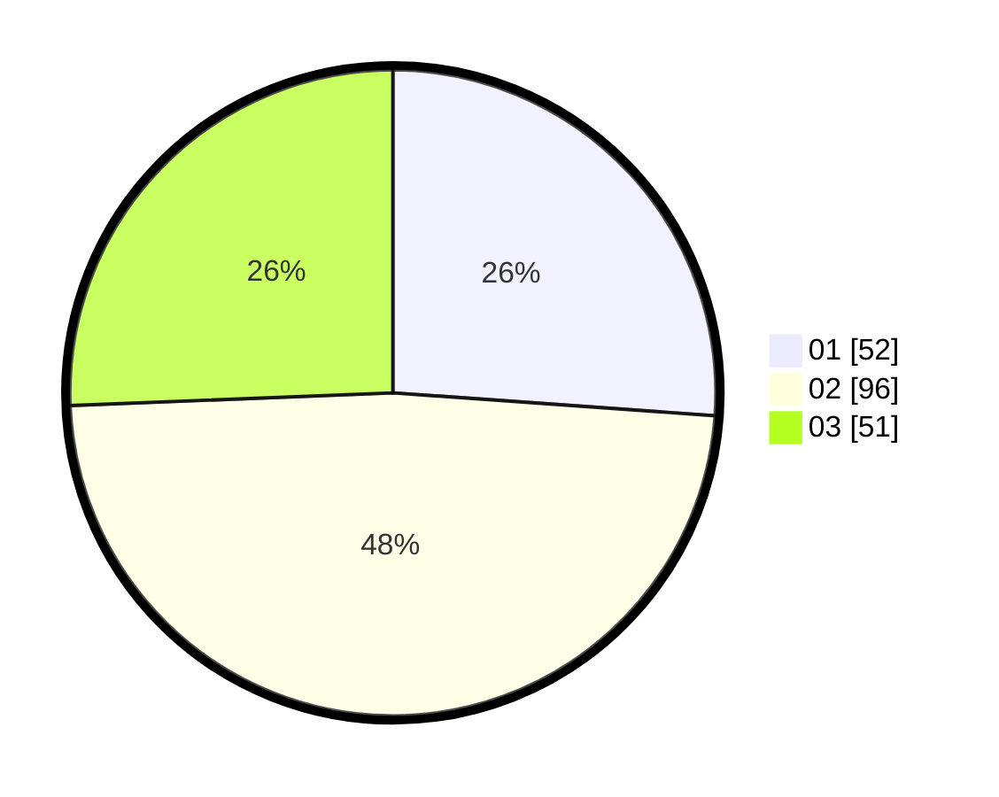

# Hasil

Hasil perolehan suara paslon dapat dilihat pada file paslon-01.txt, paslon-02.txt, dan paslon-03.txt.

Jika tidak ada, artinya data tersebut belum ada pada SIREKAP.

## Perolehan Suara

 * Paslon 01: **52**.
 * Paslon 02: **96**.
 * Paslon 03: **51**.

## Foto C Plano

https://sirekap-obj-formc.kpu.go.id/b655/pemilu/ppwp/31/73/06/10/03/3173061003081-20240214-225325--f109990f-b6e9-47fe-a377-6ba5264d0995.jpg

https://sirekap-obj-formc.kpu.go.id/b655/pemilu/ppwp/31/73/06/10/03/3173061003081-20240214-225702--e44a473c-f63b-413c-9e96-3972447597b2.jpg

https://sirekap-obj-formc.kpu.go.id/b655/pemilu/ppwp/31/73/06/10/03/3173061003081-20240214-193810--fa2a9370-820f-4fa9-b2c0-067ae0b6a277.jpg
