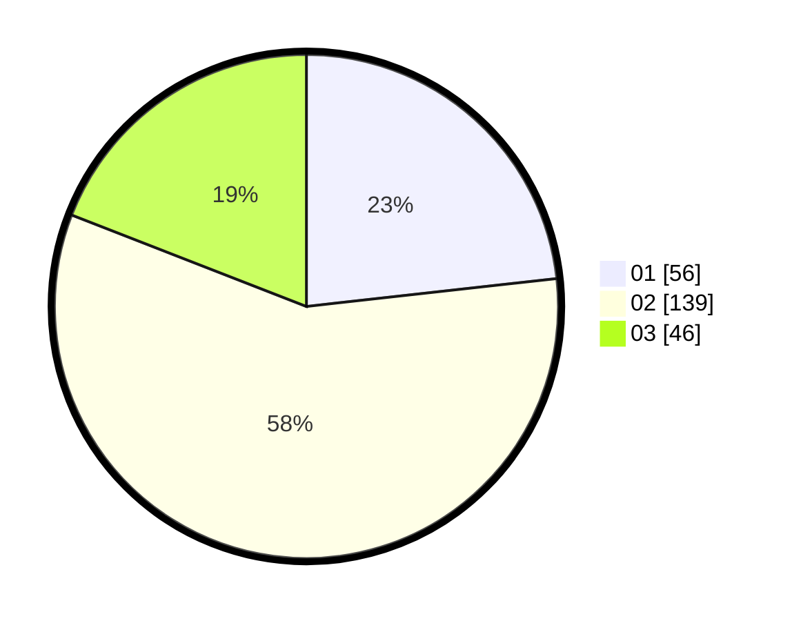

# Hasil

Hasil perolehan suara paslon dapat dilihat pada file paslon-01.txt, paslon-02.txt, dan paslon-03.txt.

Jika tidak ada, artinya data tersebut belum ada pada SIREKAP.

## Perolehan Suara

 * Paslon 01: **56**.
 * Paslon 02: **139**.
 * Paslon 03: **46**.

## Foto C Plano

https://sirekap-obj-formc.kpu.go.id/6e9e/pemilu/ppwp/31/73/06/10/03/3173061003086-20240216-160647--55598d8b-87b0-4e89-aa29-3ff87e76d061.jpg

https://sirekap-obj-formc.kpu.go.id/6e9e/pemilu/ppwp/31/73/06/10/03/3173061003086-20240216-211241--f5019d08-bd3c-4eaa-8257-e2c1281b3238.jpg

https://sirekap-obj-formc.kpu.go.id/6e9e/pemilu/ppwp/31/73/06/10/03/3173061003086-20240216-211240--b9fc22ee-8e10-477d-abdc-63138a34d17a.jpg

## DATA PEMILIH TETAP

Jumlah pemilih dalam DPT: **296**.
 * L: **143**.
 * P: **153**.

## DATA PENGGUNA HAK PILIH

Jumlah pengguna hak pilih dalam DPT: **234**.
 * L: **108**.
 * P: **126**.

Jumlah pengguna hak pilih dalam DPTb: **2**.
 * L: **1**.
 * P: **1**.

Jumlah pengguna hak pilih dalam DPK: **10**.
 * L: **5**.
 * P: **5**.

Jumlah pengguna hak pilih: **246**.
 * L: **115**.
 * P: **131**.

## JUMLAH SUARA SAH DAN TIDAK SAH

JUMLAH SELURUH SUARA SAH: **241**.

JUMLAH SUARA TIDAK SAH: **5**.

JUMLAH SELURUH SUARA SAH DAN SUARA TIDAK SAH: **246**.
