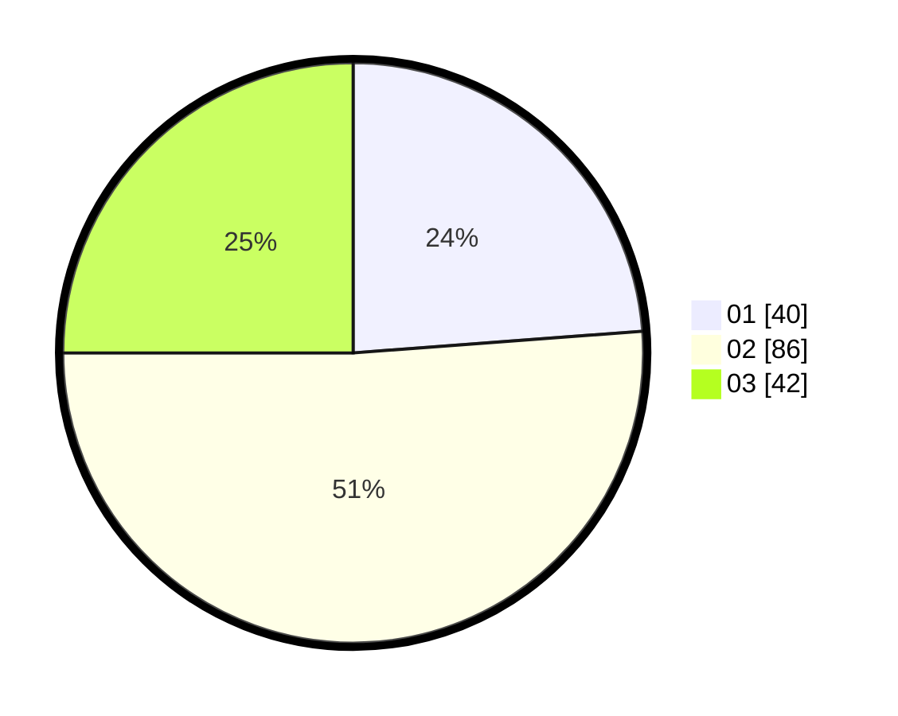

# Hasil

Hasil perolehan suara paslon dapat dilihat pada file paslon-01.txt, paslon-02.txt, dan paslon-03.txt.

Jika tidak ada, artinya data tersebut belum ada pada SIREKAP.

## Perolehan Suara

 * Paslon 01: **40**.
 * Paslon 02: **86**.
 * Paslon 03: **42**.

## Foto C Plano

https://sirekap-obj-formc.kpu.go.id/6ebf/pemilu/ppwp/31/73/06/10/03/3173061003089-20240215-121219--1f306e6b-fe2a-411e-9af2-c4a8c47b7bb5.jpg

https://sirekap-obj-formc.kpu.go.id/6ebf/pemilu/ppwp/31/73/06/10/03/3173061003089-20240215-121222--dc4d49a7-bd6c-4ec6-89a8-843851ec5b47.jpg

https://sirekap-obj-formc.kpu.go.id/6ebf/pemilu/ppwp/31/73/06/10/03/3173061003089-20240215-121225--1f3bfda7-ab50-465a-9a76-2b131456edf3.jpg
