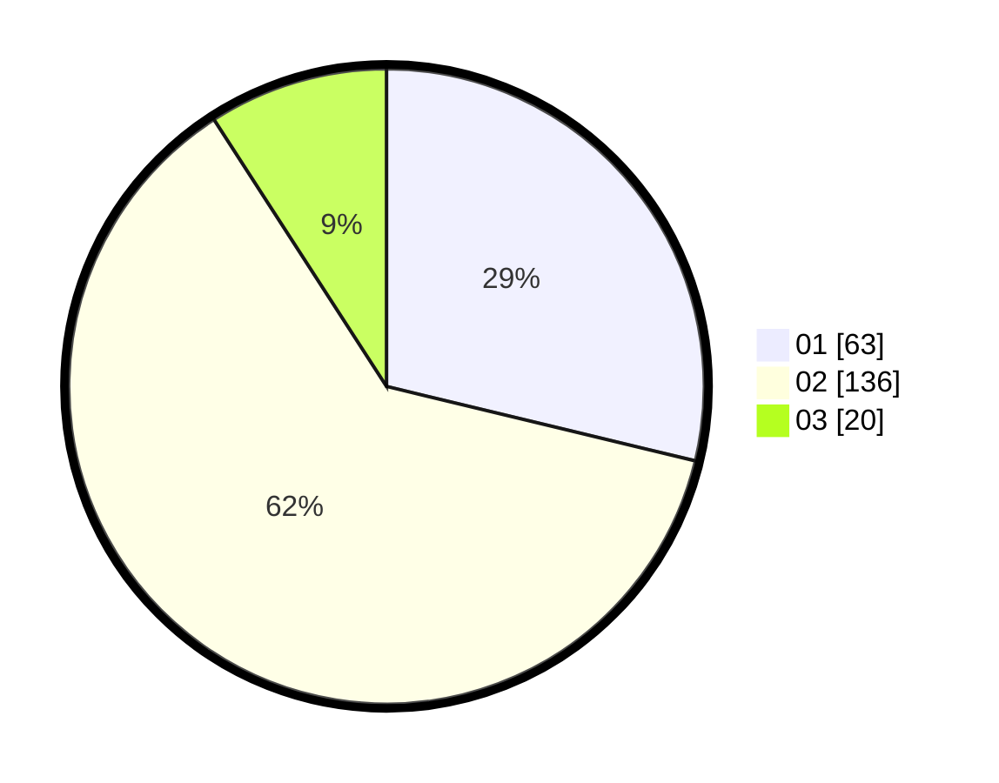

# Hasil

Hasil perolehan suara paslon dapat dilihat pada file paslon-01.txt, paslon-02.txt, dan paslon-03.txt.

Jika tidak ada, artinya data tersebut belum ada pada SIREKAP.

## Perolehan Suara

 * Paslon 01: **63**.
 * Paslon 02: **136**.
 * Paslon 03: **20**.

## Foto C Plano

https://sirekap-obj-formc.kpu.go.id/66a6/pemilu/ppwp/31/73/06/10/03/3173061003095-20240215-211725--5c465ab1-9bf8-4ef7-a094-b0334912ca10.jpg

https://sirekap-obj-formc.kpu.go.id/66a6/pemilu/ppwp/31/73/06/10/03/3173061003095-20240215-211727--888f1946-209a-42a7-8bea-5faa1e9d5f69.jpg

https://sirekap-obj-formc.kpu.go.id/66a6/pemilu/ppwp/31/73/06/10/03/3173061003095-20240215-211726--b9e77f4b-66aa-4acd-adff-7b7db2104ebf.jpg

## DATA PEMILIH TETAP

Jumlah pemilih dalam DPT: **270**.
 * L: **141**.
 * P: **129**.

## DATA PENGGUNA HAK PILIH

Jumlah pengguna hak pilih dalam DPT: **215**.
 * L: **111**.
 * P: **104**.

Jumlah pengguna hak pilih dalam DPTb: **0**.
 * L: **0**.
 * P: **0**.

Jumlah pengguna hak pilih dalam DPK: **5**.
 * L: **2**.
 * P: **3**.

Jumlah pengguna hak pilih: **220**.
 * L: **113**.
 * P: **107**.

## JUMLAH SUARA SAH DAN TIDAK SAH

JUMLAH SELURUH SUARA SAH: **219**.

JUMLAH SUARA TIDAK SAH: **1**.

JUMLAH SELURUH SUARA SAH DAN SUARA TIDAK SAH: **220**.
