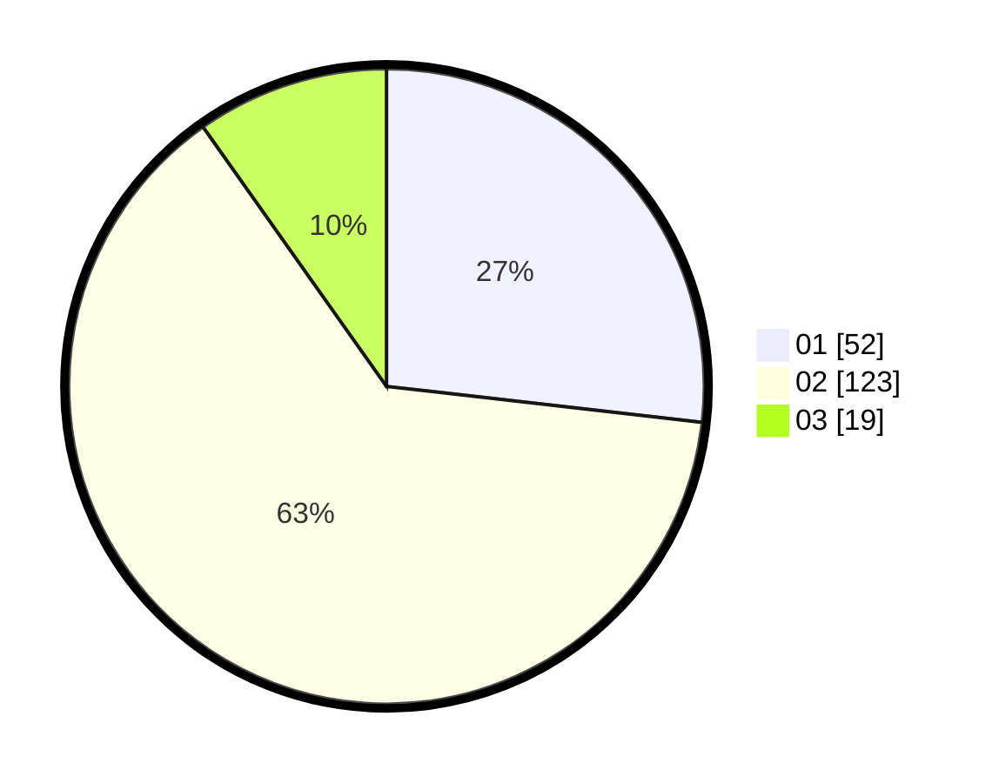

# Hasil

Hasil perolehan suara paslon dapat dilihat pada file paslon-01.txt, paslon-02.txt, dan paslon-03.txt.

Jika tidak ada, artinya data tersebut belum ada pada SIREKAP.

## Perolehan Suara

 * Paslon 01: **52**.
 * Paslon 02: **123**.
 * Paslon 03: **19**.

## Foto C Plano

https://sirekap-obj-formc.kpu.go.id/1cfc/pemilu/ppwp/31/73/06/10/03/3173061003101-20240214-191125--0cf314cb-7d66-42d8-aeff-6e712e88e106.jpg

https://sirekap-obj-formc.kpu.go.id/1cfc/pemilu/ppwp/31/73/06/10/03/3173061003101-20240214-190500--5f383bca-7c25-4c52-8447-a06fcee8500e.jpg

https://sirekap-obj-formc.kpu.go.id/1cfc/pemilu/ppwp/31/73/06/10/03/3173061003101-20240214-190505--d29ced59-f764-40b2-8155-45879779c2c3.jpg

## DATA PEMILIH TETAP

Jumlah pemilih dalam DPT: **274**.
 * L: **135**.
 * P: **139**.

## DATA PENGGUNA HAK PILIH

Jumlah pengguna hak pilih dalam DPT: **274**.
 * L: **135**.
 * P: **139**.

Jumlah pengguna hak pilih dalam DPTb: **0**.
 * L: **0**.
 * P: **0**.

Jumlah pengguna hak pilih dalam DPK: **1**.
 * L: **0**.
 * P: **1**.

Jumlah pengguna hak pilih: **275**.
 * L: **135**.
 * P: **140**.

## JUMLAH SUARA SAH DAN TIDAK SAH

JUMLAH SELURUH SUARA SAH: **194**.

JUMLAH SUARA TIDAK SAH: **4**.

JUMLAH SELURUH SUARA SAH DAN SUARA TIDAK SAH: **198**.
