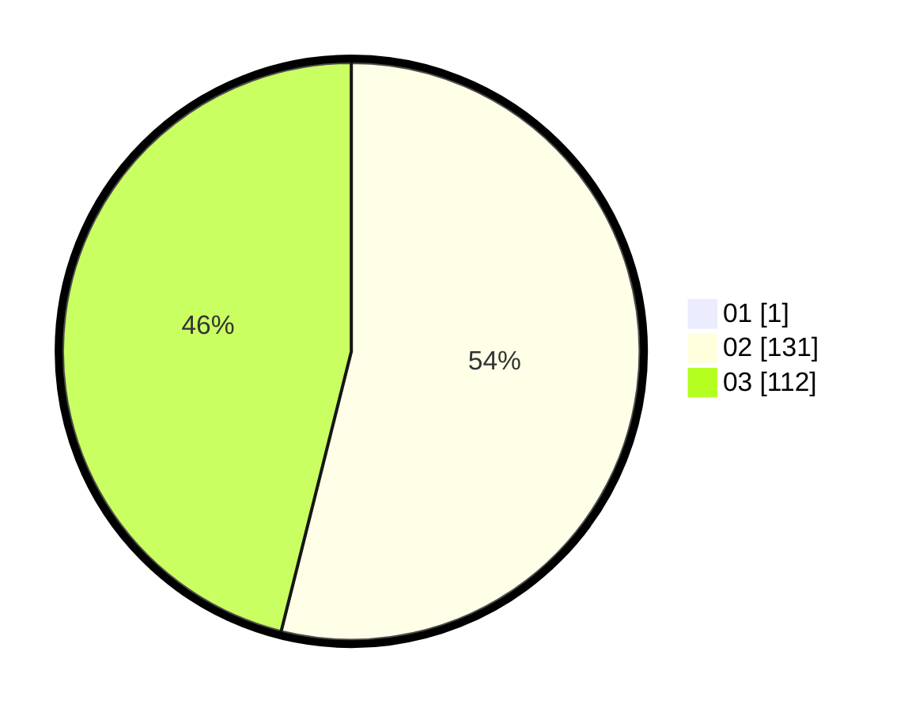

# Hasil

Hasil perolehan suara paslon dapat dilihat pada file paslon-01.txt, paslon-02.txt, dan paslon-03.txt.

Jika tidak ada, artinya data tersebut belum ada pada SIREKAP.

## Perolehan Suara

 * Paslon 01: **1**.
 * Paslon 02: **131**.
 * Paslon 03: **112**.

## Foto C Plano

https://sirekap-obj-formc.kpu.go.id/f1e7/pemilu/ppwp/31/73/06/10/03/3173061003105-20240214-202451--7b9491b2-d859-47f6-a00b-3288743eb0bf.jpg

https://sirekap-obj-formc.kpu.go.id/f1e7/pemilu/ppwp/31/73/06/10/03/3173061003105-20240214-202840--d2507c99-4f75-4859-9957-185b75d37280.jpg

https://sirekap-obj-formc.kpu.go.id/f1e7/pemilu/ppwp/31/73/06/10/03/3173061003105-20240214-231854--6588868e-849a-46ce-983c-7b55bc7c1113.jpg
