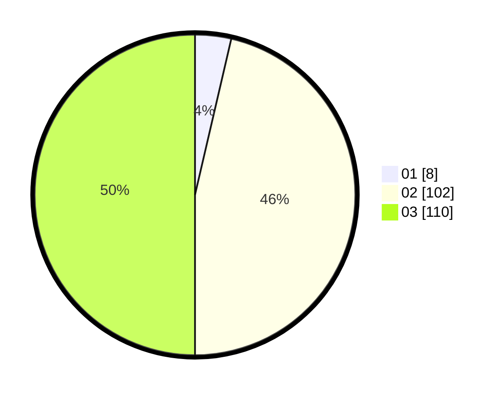

# Hasil

Hasil perolehan suara paslon dapat dilihat pada file paslon-01.txt, paslon-02.txt, dan paslon-03.txt.

Jika tidak ada, artinya data tersebut belum ada pada SIREKAP.

## Perolehan Suara

 * Paslon 01: **8**.
 * Paslon 02: **102**.
 * Paslon 03: **110**.

## Foto C Plano

https://sirekap-obj-formc.kpu.go.id/72cd/pemilu/ppwp/31/73/06/10/03/3173061003107-20240214-203843--36c5788b-d9bd-4c8c-add4-629412e60595.jpg

https://sirekap-obj-formc.kpu.go.id/72cd/pemilu/ppwp/31/73/06/10/03/3173061003107-20240214-225855--46f67072-d478-4084-8599-9d788615526c.jpg

https://sirekap-obj-formc.kpu.go.id/72cd/pemilu/ppwp/31/73/06/10/03/3173061003107-20240214-230021--5fb0d9a4-5eed-4b0b-bf2b-c2b9dae67ea0.jpg
