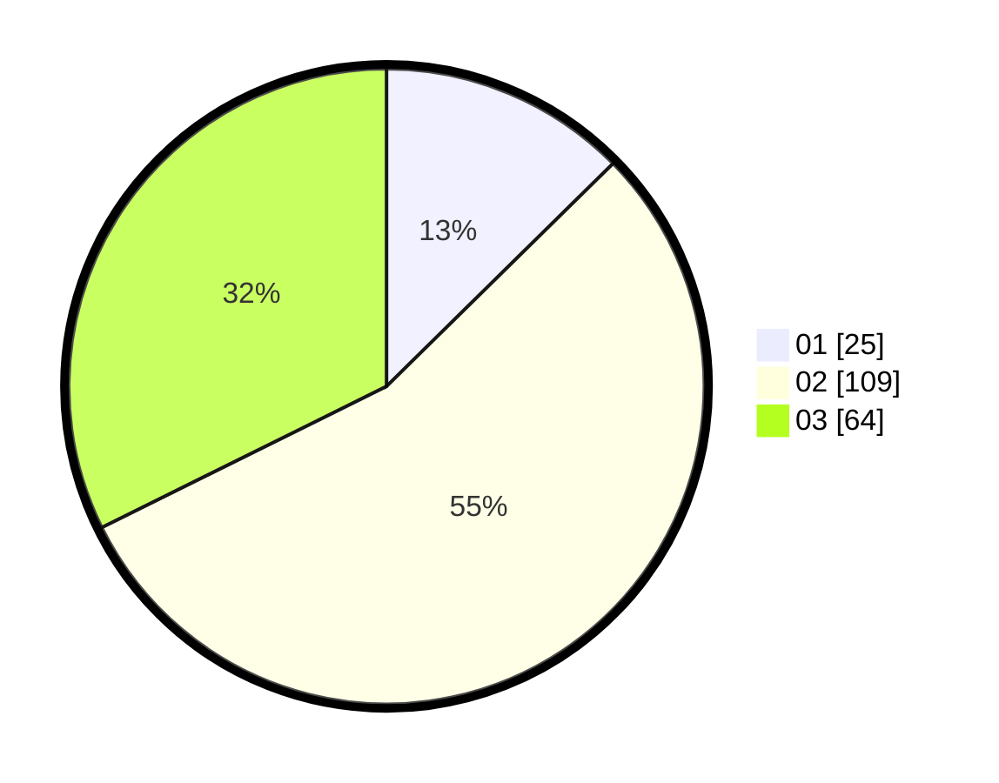

# Hasil

Hasil perolehan suara paslon dapat dilihat pada file paslon-01.txt, paslon-02.txt, dan paslon-03.txt.

Jika tidak ada, artinya data tersebut belum ada pada SIREKAP.

## Perolehan Suara

 * Paslon 01: **25**.
 * Paslon 02: **109**.
 * Paslon 03: **64**.

## Foto C Plano

https://sirekap-obj-formc.kpu.go.id/2815/pemilu/ppwp/31/73/06/10/03/3173061003109-20240216-012242--7dfa23d0-df37-4a21-8457-16314e38237e.jpg

https://sirekap-obj-formc.kpu.go.id/2815/pemilu/ppwp/31/73/06/10/03/3173061003109-20240216-012254--eb561302-275a-4e39-8c1e-a420cf59b242.jpg

https://sirekap-obj-formc.kpu.go.id/2815/pemilu/ppwp/31/73/06/10/03/3173061003109-20240216-013635--491dbb3f-4d9e-4b49-ba0f-25fa3af5308d.jpg

## DATA PEMILIH TETAP

Jumlah pemilih dalam DPT: **266**.
 * L: **132**.
 * P: **134**.

## DATA PENGGUNA HAK PILIH

Jumlah pengguna hak pilih dalam DPT: **198**.
 * L: **96**.
 * P: **102**.

Jumlah pengguna hak pilih dalam DPTb: **3**.
 * L: **1**.
 * P: **2**.

Jumlah pengguna hak pilih dalam DPK: **2**.
 * L: **2**.
 * P: **0**.

Jumlah pengguna hak pilih: **203**.
 * L: **99**.
 * P: **104**.

## JUMLAH SUARA SAH DAN TIDAK SAH

JUMLAH SELURUH SUARA SAH: **198**.

JUMLAH SUARA TIDAK SAH: **9**.

JUMLAH SELURUH SUARA SAH DAN SUARA TIDAK SAH: **207**.
