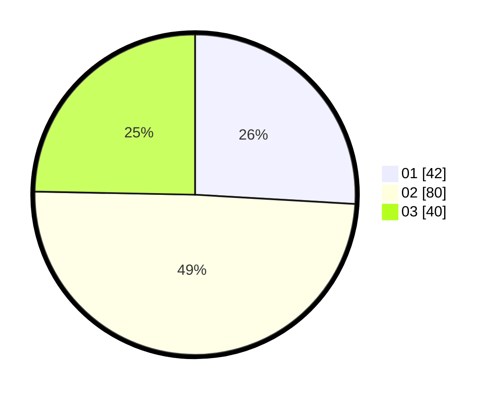

# Hasil

Hasil perolehan suara paslon dapat dilihat pada file paslon-01.txt, paslon-02.txt, dan paslon-03.txt.

Jika tidak ada, artinya data tersebut belum ada pada SIREKAP.

## Perolehan Suara

 * Paslon 01: **42**.
 * Paslon 02: **80**.
 * Paslon 03: **40**.

## Foto C Plano

https://sirekap-obj-formc.kpu.go.id/b761/pemilu/ppwp/31/73/06/10/03/3173061003110-20240216-004915--95d1e732-bb4f-493f-9fb1-aae323daf1f7.jpg

https://sirekap-obj-formc.kpu.go.id/b761/pemilu/ppwp/31/73/06/10/03/3173061003110-20240216-004757--2ad1ed56-c12a-4664-9f46-d7d365223b9e.jpg

https://sirekap-obj-formc.kpu.go.id/b761/pemilu/ppwp/31/73/06/10/03/3173061003110-20240216-004749--b768b1d4-d3df-49d6-9fc6-f65ba009c500.jpg

## DATA PEMILIH TETAP

Jumlah pemilih dalam DPT: **224**.
 * L: **104**.
 * P: **120**.

## DATA PENGGUNA HAK PILIH

Jumlah pengguna hak pilih dalam DPT: **159**.
 * L: **68**.
 * P: **91**.

Jumlah pengguna hak pilih dalam DPTb: **0**.
 * L: **0**.
 * P: **0**.

Jumlah pengguna hak pilih dalam DPK: **5**.
 * L: **3**.
 * P: **2**.

Jumlah pengguna hak pilih: **164**.
 * L: **71**.
 * P: **93**.

## JUMLAH SUARA SAH DAN TIDAK SAH

JUMLAH SELURUH SUARA SAH: **162**.

JUMLAH SUARA TIDAK SAH: **2**.

JUMLAH SELURUH SUARA SAH DAN SUARA TIDAK SAH: **164**.
