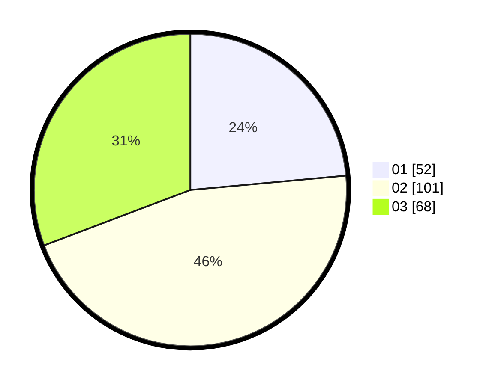

# Hasil

Hasil perolehan suara paslon dapat dilihat pada file paslon-01.txt, paslon-02.txt, dan paslon-03.txt.

Jika tidak ada, artinya data tersebut belum ada pada SIREKAP.

## Perolehan Suara

 * Paslon 01: **52**.
 * Paslon 02: **101**.
 * Paslon 03: **68**.

## Foto C Plano

https://sirekap-obj-formc.kpu.go.id/a2d6/pemilu/ppwp/31/73/06/10/03/3173061003113-20240215-040140--7a9727a1-6795-4b46-9a62-d0d90e2155e9.jpg

https://sirekap-obj-formc.kpu.go.id/a2d6/pemilu/ppwp/31/73/06/10/03/3173061003113-20240215-040202--9bf7c923-3f99-4b14-9ea5-2636ace10b9c.jpg

https://sirekap-obj-formc.kpu.go.id/a2d6/pemilu/ppwp/31/73/06/10/03/3173061003113-20240215-040152--e82fdb77-7253-4e88-9721-577ccd390e94.jpg

## DATA PEMILIH TETAP

Jumlah pemilih dalam DPT: **297**.
 * L: **142**.
 * P: **155**.

## DATA PENGGUNA HAK PILIH

Jumlah pengguna hak pilih dalam DPT: **224**.
 * L: **100**.
 * P: **124**.

Jumlah pengguna hak pilih dalam DPTb: **0**.
 * L: **0**.
 * P: **0**.

Jumlah pengguna hak pilih dalam DPK: **0**.
 * L: **0**.
 * P: **0**.

Jumlah pengguna hak pilih: **224**.
 * L: **100**.
 * P: **124**.

## JUMLAH SUARA SAH DAN TIDAK SAH

JUMLAH SELURUH SUARA SAH: **221**.

JUMLAH SUARA TIDAK SAH: **3**.

JUMLAH SELURUH SUARA SAH DAN SUARA TIDAK SAH: **224**.
