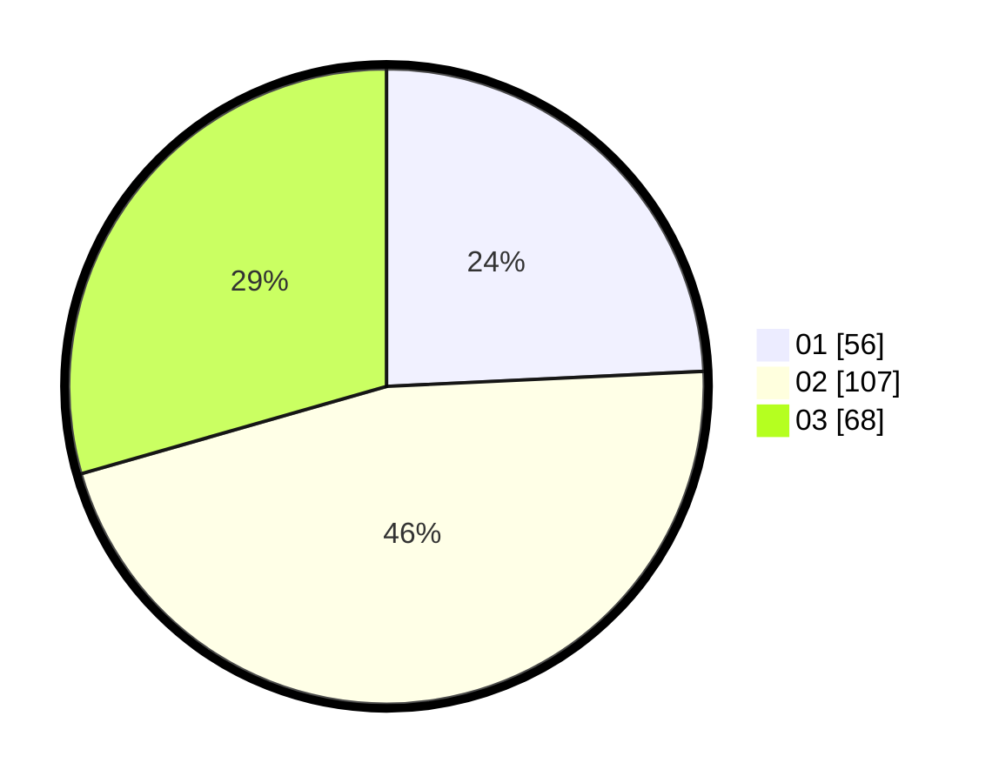

# Hasil

Hasil perolehan suara paslon dapat dilihat pada file paslon-01.txt, paslon-02.txt, dan paslon-03.txt.

Jika tidak ada, artinya data tersebut belum ada pada SIREKAP.

## Perolehan Suara

 * Paslon 01: **56**.
 * Paslon 02: **107**.
 * Paslon 03: **68**.

## Foto C Plano

https://sirekap-obj-formc.kpu.go.id/f2cd/pemilu/ppwp/31/73/06/10/03/3173061003114-20240215-045029--8e21508b-209c-488c-967a-2fec39e1d308.jpg

https://sirekap-obj-formc.kpu.go.id/f2cd/pemilu/ppwp/31/73/06/10/03/3173061003114-20240215-045129--1090a951-e960-409f-b547-6dcb01aa83b6.jpg

https://sirekap-obj-formc.kpu.go.id/f2cd/pemilu/ppwp/31/73/06/10/03/3173061003114-20240215-045210--70e58d00-ec2d-4be7-940d-9dad532040f2.jpg
