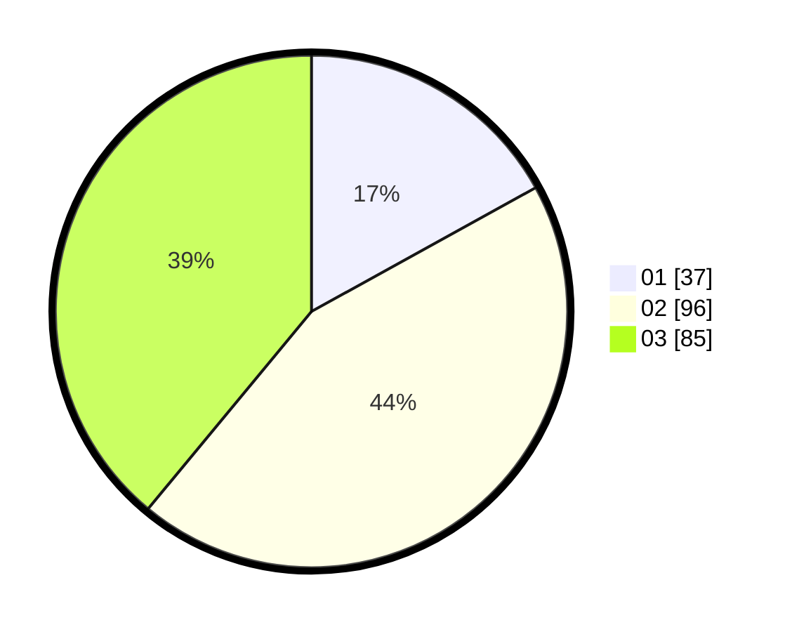

# Hasil

Hasil perolehan suara paslon dapat dilihat pada file paslon-01.txt, paslon-02.txt, dan paslon-03.txt.

Jika tidak ada, artinya data tersebut belum ada pada SIREKAP.

## Perolehan Suara

 * Paslon 01: **37**.
 * Paslon 02: **96**.
 * Paslon 03: **85**.

## Foto C Plano

https://sirekap-obj-formc.kpu.go.id/52c6/pemilu/ppwp/31/73/06/10/03/3173061003115-20240216-152654--51af0887-7f3b-479a-bed9-354b065e1465.jpg

https://sirekap-obj-formc.kpu.go.id/52c6/pemilu/ppwp/31/73/06/10/03/3173061003115-20240216-152656--9808dda7-2c04-47da-8862-5e0b7f0b9f44.jpg

https://sirekap-obj-formc.kpu.go.id/52c6/pemilu/ppwp/31/73/06/10/03/3173061003115-20240216-152655--aff5b864-0470-429d-b381-f4196754dfbd.jpg

## DATA PEMILIH TETAP

Jumlah pemilih dalam DPT: **274**.
 * L: **131**.
 * P: **143**.

## DATA PENGGUNA HAK PILIH

Jumlah pengguna hak pilih dalam DPT: **219**.
 * L: **103**.
 * P: **116**.

Jumlah pengguna hak pilih dalam DPTb: **0**.
 * L: **0**.
 * P: **0**.

Jumlah pengguna hak pilih dalam DPK: **1**.
 * L: **0**.
 * P: **1**.

Jumlah pengguna hak pilih: **220**.
 * L: **103**.
 * P: **117**.

## JUMLAH SUARA SAH DAN TIDAK SAH

JUMLAH SELURUH SUARA SAH: **218**.

JUMLAH SUARA TIDAK SAH: **2**.

JUMLAH SELURUH SUARA SAH DAN SUARA TIDAK SAH: **220**.
