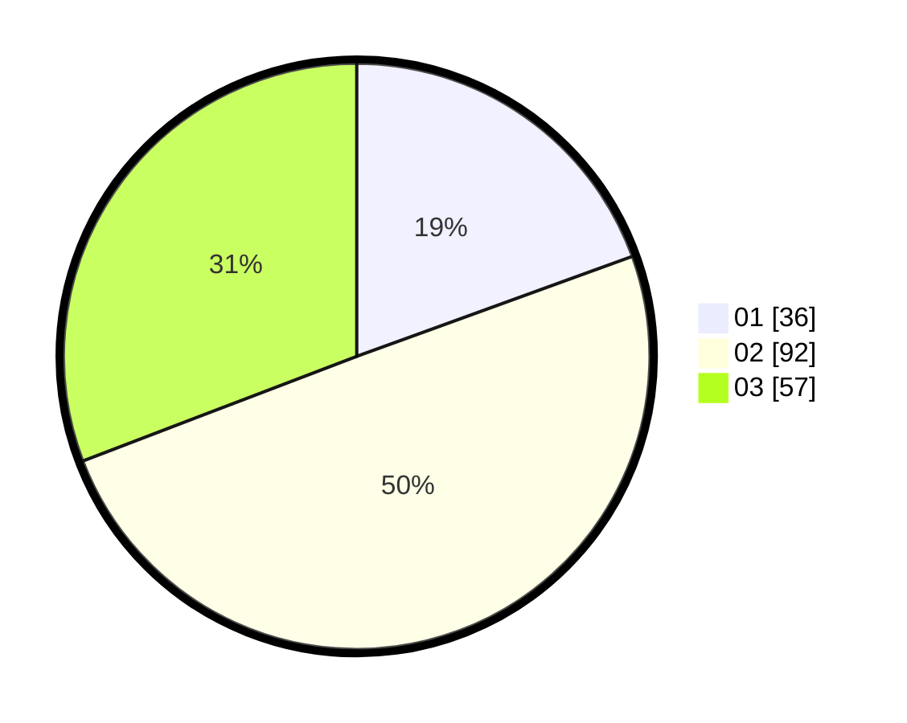

# Hasil

Hasil perolehan suara paslon dapat dilihat pada file paslon-01.txt, paslon-02.txt, dan paslon-03.txt.

Jika tidak ada, artinya data tersebut belum ada pada SIREKAP.

## Perolehan Suara

 * Paslon 01: **36**.
 * Paslon 02: **92**.
 * Paslon 03: **57**.

## Foto C Plano

https://sirekap-obj-formc.kpu.go.id/a4e4/pemilu/ppwp/31/73/06/10/03/3173061003118-20240216-134353--0e0d79d9-39fb-4a3f-86ff-2b57bf2e4b05.jpg

https://sirekap-obj-formc.kpu.go.id/a4e4/pemilu/ppwp/31/73/06/10/03/3173061003118-20240216-134354--d219d4f7-dde5-4e15-99d3-15205c5d1a33.jpg

https://sirekap-obj-formc.kpu.go.id/a4e4/pemilu/ppwp/31/73/06/10/03/3173061003118-20240216-134354--eff94875-667d-4ab2-862c-18cbf45a01c6.jpg

## DATA PEMILIH TETAP

Jumlah pemilih dalam DPT: **265**.
 * L: **116**.
 * P: **149**.

## DATA PENGGUNA HAK PILIH

Jumlah pengguna hak pilih dalam DPT: **188**.
 * L: **82**.
 * P: **106**.

Jumlah pengguna hak pilih dalam DPTb: **1**.
 * L: **0**.
 * P: **1**.

Jumlah pengguna hak pilih dalam DPK: **0**.
 * L: **0**.
 * P: **0**.

Jumlah pengguna hak pilih: **189**.
 * L: **82**.
 * P: **107**.

## JUMLAH SUARA SAH DAN TIDAK SAH

JUMLAH SELURUH SUARA SAH: **185**.

JUMLAH SUARA TIDAK SAH: **4**.

JUMLAH SELURUH SUARA SAH DAN SUARA TIDAK SAH: **189**.
