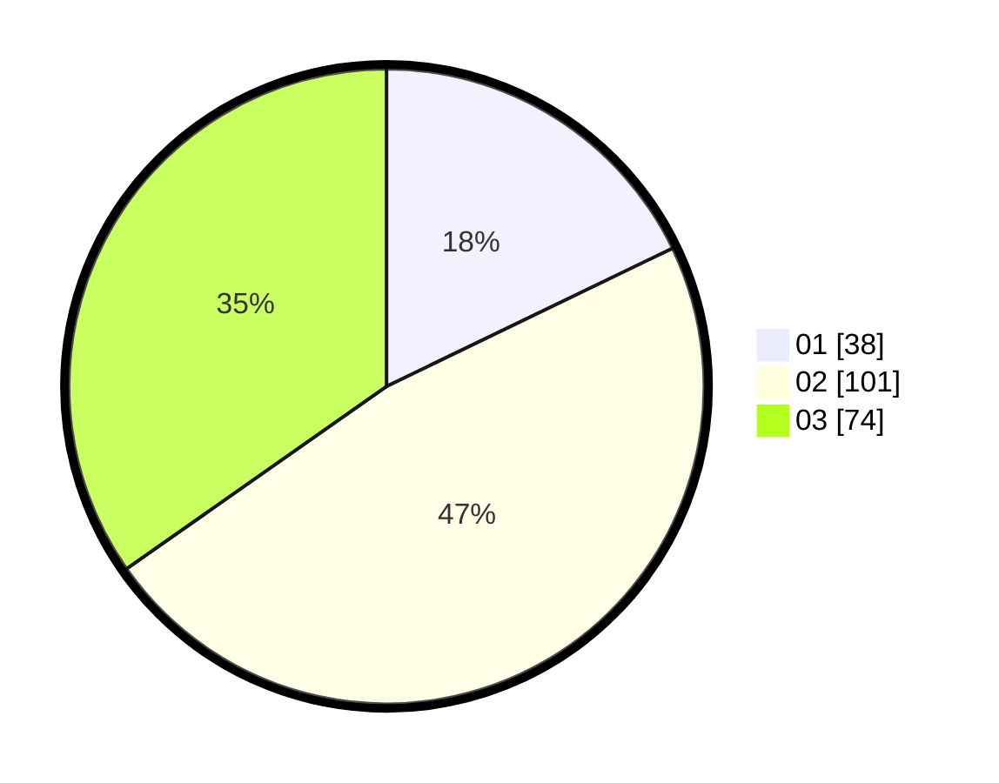

# Hasil

Hasil perolehan suara paslon dapat dilihat pada file paslon-01.txt, paslon-02.txt, dan paslon-03.txt.

Jika tidak ada, artinya data tersebut belum ada pada SIREKAP.

## Perolehan Suara

 * Paslon 01: **38**.
 * Paslon 02: **101**.
 * Paslon 03: **74**.

## Foto C Plano

https://sirekap-obj-formc.kpu.go.id/3980/pemilu/ppwp/31/73/06/10/03/3173061003119-20240214-220914--62e0ac1b-e327-4313-a7f2-1172bfadf1d9.jpg

https://sirekap-obj-formc.kpu.go.id/3980/pemilu/ppwp/31/73/06/10/03/3173061003119-20240214-221153--cb3de4eb-aec4-4ce2-a339-65d8b23a6ed3.jpg

https://sirekap-obj-formc.kpu.go.id/3980/pemilu/ppwp/31/73/06/10/03/3173061003119-20240214-221226--4212b9bc-13be-46b5-ad54-723ee85df4ff.jpg
