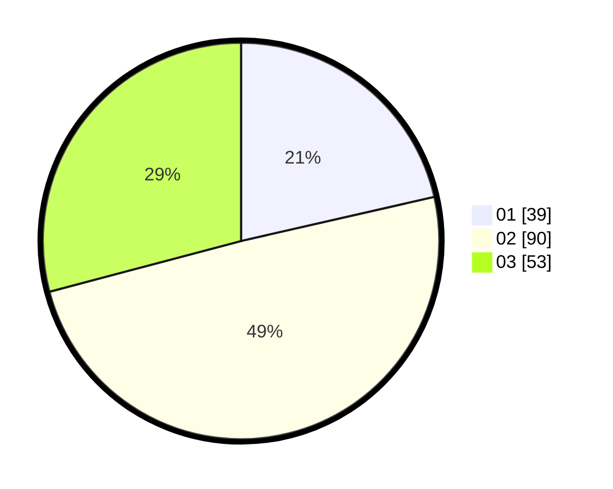

# Hasil

Hasil perolehan suara paslon dapat dilihat pada file paslon-01.txt, paslon-02.txt, dan paslon-03.txt.

Jika tidak ada, artinya data tersebut belum ada pada SIREKAP.

## Perolehan Suara

 * Paslon 01: **39**.
 * Paslon 02: **90**.
 * Paslon 03: **53**.

## Foto C Plano

https://sirekap-obj-formc.kpu.go.id/2550/pemilu/ppwp/31/73/06/10/03/3173061003121-20240215-003524--6941b2a9-5ac2-4839-af81-d143895241b6.jpg

https://sirekap-obj-formc.kpu.go.id/2550/pemilu/ppwp/31/73/06/10/03/3173061003121-20240215-003622--ba92b22d-b884-4dcd-a58f-83771e064cb8.jpg

https://sirekap-obj-formc.kpu.go.id/2550/pemilu/ppwp/31/73/06/10/03/3173061003121-20240215-003854--cf681c56-483b-4cb8-b551-6399ed8b1049.jpg
