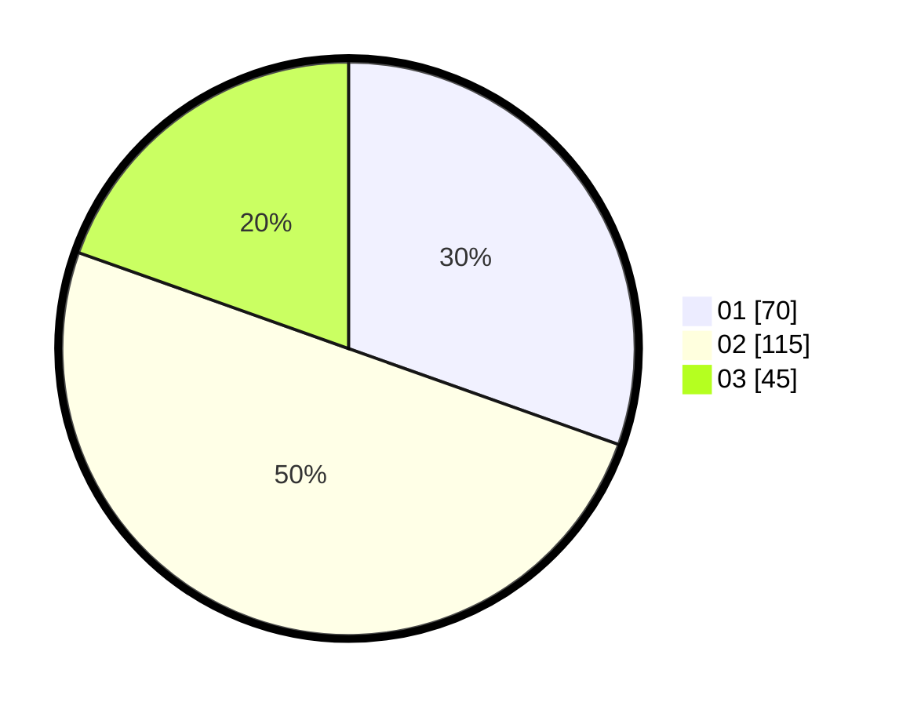

# Hasil

Hasil perolehan suara paslon dapat dilihat pada file paslon-01.txt, paslon-02.txt, dan paslon-03.txt.

Jika tidak ada, artinya data tersebut belum ada pada SIREKAP.

## Perolehan Suara

 * Paslon 01: **70**.
 * Paslon 02: **115**.
 * Paslon 03: **45**.

## Foto C Plano

https://sirekap-obj-formc.kpu.go.id/85f3/pemilu/ppwp/31/73/06/10/03/3173061003126-20240214-202833--9f59a642-1940-44eb-8221-3a6075b21beb.jpg

https://sirekap-obj-formc.kpu.go.id/85f3/pemilu/ppwp/31/73/06/10/03/3173061003126-20240214-202859--ecf6dcfd-e1d2-4701-b070-e4dcefb9b1c3.jpg

https://sirekap-obj-formc.kpu.go.id/85f3/pemilu/ppwp/31/73/06/10/03/3173061003126-20240214-202927--11fa168f-ca46-4425-b693-6928a10b8fbc.jpg

## DATA PEMILIH TETAP

Jumlah pemilih dalam DPT: **262**.
 * L: **121**.
 * P: **141**.

## DATA PENGGUNA HAK PILIH

Jumlah pengguna hak pilih dalam DPT: **192**.
 * L: **85**.
 * P: **107**.

Jumlah pengguna hak pilih dalam DPTb: **0**.
 * L: **0**.
 * P: **0**.

Jumlah pengguna hak pilih dalam DPK: **1**.
 * L: **1**.
 * P: **0**.

Jumlah pengguna hak pilih: **193**.
 * L: **86**.
 * P: **107**.

## JUMLAH SUARA SAH DAN TIDAK SAH

JUMLAH SELURUH SUARA SAH: **190**.

JUMLAH SUARA TIDAK SAH: **3**.

JUMLAH SELURUH SUARA SAH DAN SUARA TIDAK SAH: **193**.
