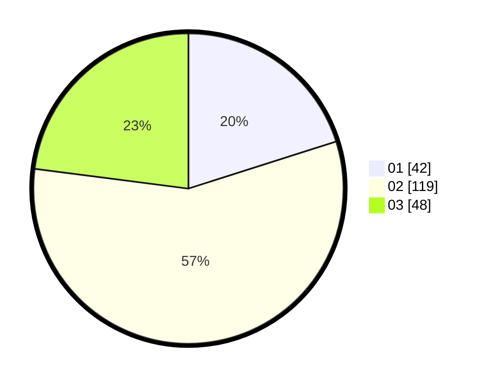

# Hasil

Hasil perolehan suara paslon dapat dilihat pada file paslon-01.txt, paslon-02.txt, dan paslon-03.txt.

Jika tidak ada, artinya data tersebut belum ada pada SIREKAP.

## Perolehan Suara

 * Paslon 01: **42**.
 * Paslon 02: **119**.
 * Paslon 03: **48**.

## Foto C Plano

https://sirekap-obj-formc.kpu.go.id/63d6/pemilu/ppwp/31/73/06/10/03/3173061003127-20240215-205853--ff01bc4c-ab99-4d91-9d2b-77a958d459c5.jpg

https://sirekap-obj-formc.kpu.go.id/63d6/pemilu/ppwp/31/73/06/10/03/3173061003127-20240214-184615--6d378c9f-47e5-450e-bd28-52e9c9de4e26.jpg

https://sirekap-obj-formc.kpu.go.id/63d6/pemilu/ppwp/31/73/06/10/03/3173061003127-20240215-205855--6c3ef1d4-ac78-4b1b-96d5-6887fb82171e.jpg

## DATA PEMILIH TETAP

Jumlah pemilih dalam DPT: **290**.
 * L: **137**.
 * P: **153**.

## DATA PENGGUNA HAK PILIH

Jumlah pengguna hak pilih dalam DPT: **206**.
 * L: **97**.
 * P: **109**.

Jumlah pengguna hak pilih dalam DPTb: **0**.
 * L: **0**.
 * P: **0**.

Jumlah pengguna hak pilih dalam DPK: **6**.
 * L: **2**.
 * P: **4**.

Jumlah pengguna hak pilih: **212**.
 * L: **99**.
 * P: **113**.

## JUMLAH SUARA SAH DAN TIDAK SAH

JUMLAH SELURUH SUARA SAH: **209**.

JUMLAH SUARA TIDAK SAH: **3**.

JUMLAH SELURUH SUARA SAH DAN SUARA TIDAK SAH: **212**.
