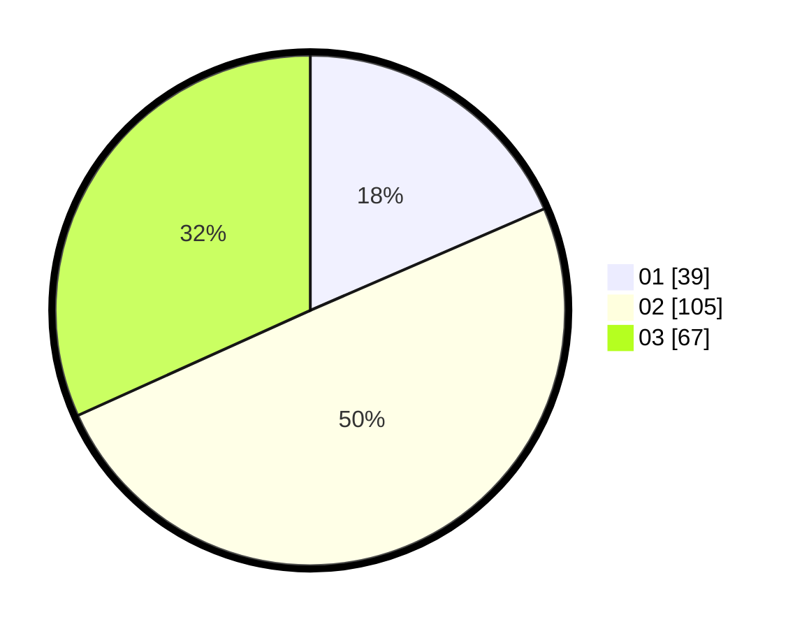

# Hasil

Hasil perolehan suara paslon dapat dilihat pada file paslon-01.txt, paslon-02.txt, dan paslon-03.txt.

Jika tidak ada, artinya data tersebut belum ada pada SIREKAP.

## Perolehan Suara

 * Paslon 01: **39**.
 * Paslon 02: **105**.
 * Paslon 03: **67**.

## Foto C Plano

https://sirekap-obj-formc.kpu.go.id/8895/pemilu/ppwp/31/73/06/10/03/3173061003128-20240214-214821--b6c11cae-f3d1-4ca3-9c0e-8b85175f10b9.jpg

https://sirekap-obj-formc.kpu.go.id/8895/pemilu/ppwp/31/73/06/10/03/3173061003128-20240214-202820--6c8ab491-22ca-4e25-a02d-997c00771089.jpg

https://sirekap-obj-formc.kpu.go.id/8895/pemilu/ppwp/31/73/06/10/03/3173061003128-20240214-214719--45658d84-3cff-40eb-b824-b4c8bfb599d8.jpg
