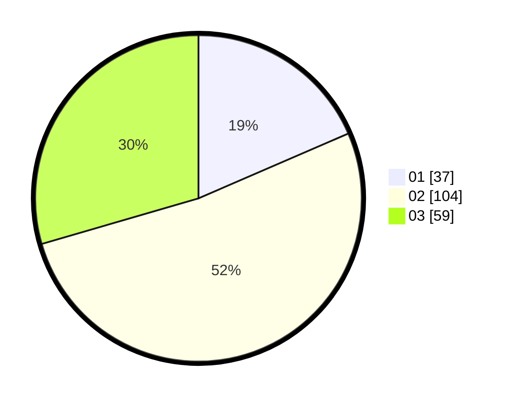

# Hasil

Hasil perolehan suara paslon dapat dilihat pada file paslon-01.txt, paslon-02.txt, dan paslon-03.txt.

Jika tidak ada, artinya data tersebut belum ada pada SIREKAP.

## Perolehan Suara

 * Paslon 01: **37**.
 * Paslon 02: **104**.
 * Paslon 03: **59**.

## Foto C Plano

https://sirekap-obj-formc.kpu.go.id/91a6/pemilu/ppwp/31/73/06/10/03/3173061003131-20240215-233116--8df4d044-f38a-4836-9d41-90e66bc986e5.jpg

https://sirekap-obj-formc.kpu.go.id/91a6/pemilu/ppwp/31/73/06/10/03/3173061003131-20240215-233123--3d5de053-a3fb-49a3-9add-e4de625e9729.jpg

https://sirekap-obj-formc.kpu.go.id/91a6/pemilu/ppwp/31/73/06/10/03/3173061003131-20240215-233119--1329781c-318f-47b2-b80c-aaa136107016.jpg

## DATA PEMILIH TETAP

Jumlah pemilih dalam DPT: **279**.
 * L: **132**.
 * P: **147**.

## DATA PENGGUNA HAK PILIH

Jumlah pengguna hak pilih dalam DPT: **199**.
 * L: **97**.
 * P: **102**.

Jumlah pengguna hak pilih dalam DPTb: **1**.
 * L: **1**.
 * P: **0**.

Jumlah pengguna hak pilih dalam DPK: **1**.
 * L: **0**.
 * P: **1**.

Jumlah pengguna hak pilih: **201**.
 * L: **98**.
 * P: **103**.

## JUMLAH SUARA SAH DAN TIDAK SAH

JUMLAH SELURUH SUARA SAH: **200**.

JUMLAH SUARA TIDAK SAH: **1**.

JUMLAH SELURUH SUARA SAH DAN SUARA TIDAK SAH: **201**.
