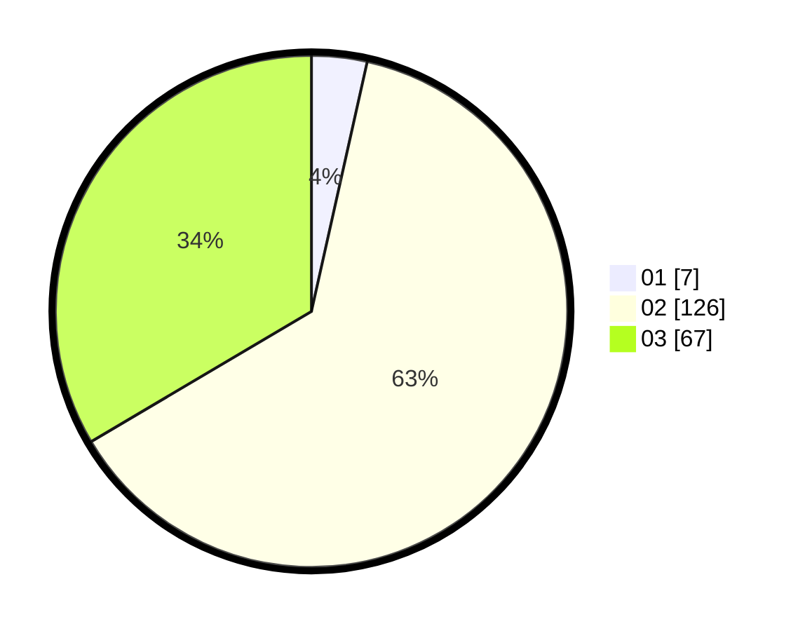

# Hasil

Hasil perolehan suara paslon dapat dilihat pada file paslon-01.txt, paslon-02.txt, dan paslon-03.txt.

Jika tidak ada, artinya data tersebut belum ada pada SIREKAP.

## Perolehan Suara

 * Paslon 01: **7**.
 * Paslon 02: **126**.
 * Paslon 03: **67**.

## Foto C Plano

https://sirekap-obj-formc.kpu.go.id/512d/pemilu/ppwp/31/73/06/10/03/3173061003136-20240214-205827--d6d39029-394a-4b74-ab30-9b586e460e3c.jpg

https://sirekap-obj-formc.kpu.go.id/512d/pemilu/ppwp/31/73/06/10/03/3173061003136-20240214-202211--24a82d70-293f-4396-8ecb-9af2ca53179a.jpg

https://sirekap-obj-formc.kpu.go.id/512d/pemilu/ppwp/31/73/06/10/03/3173061003136-20240214-202313--f2c3d65a-3d16-44af-a1db-d3a7d90ac43c.jpg

## DATA PEMILIH TETAP

Jumlah pemilih dalam DPT: **279**.
 * L: **127**.
 * P: **152**.

## DATA PENGGUNA HAK PILIH

Jumlah pengguna hak pilih dalam DPT: **203**.
 * L: **81**.
 * P: **122**.

Jumlah pengguna hak pilih dalam DPTb: **0**.
 * L: **0**.
 * P: **0**.

Jumlah pengguna hak pilih dalam DPK: **0**.
 * L: **0**.
 * P: **0**.

Jumlah pengguna hak pilih: **203**.
 * L: **81**.
 * P: **122**.

## JUMLAH SUARA SAH DAN TIDAK SAH

JUMLAH SELURUH SUARA SAH: **200**.

JUMLAH SUARA TIDAK SAH: **3**.

JUMLAH SELURUH SUARA SAH DAN SUARA TIDAK SAH: **203**.
