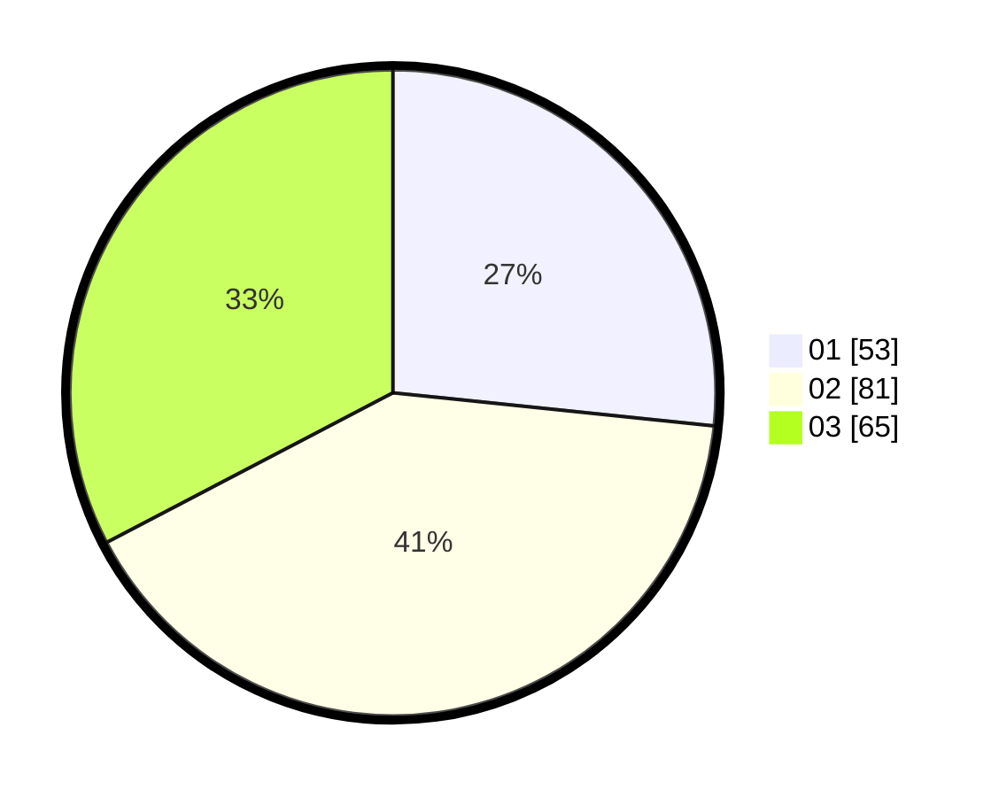

# Hasil

Hasil perolehan suara paslon dapat dilihat pada file paslon-01.txt, paslon-02.txt, dan paslon-03.txt.

Jika tidak ada, artinya data tersebut belum ada pada SIREKAP.

## Perolehan Suara

 * Paslon 01: **53**.
 * Paslon 02: **81**.
 * Paslon 03: **65**.

## Foto C Plano

https://sirekap-obj-formc.kpu.go.id/d984/pemilu/ppwp/31/73/06/10/03/3173061003139-20240214-221436--b20e270d-d1ed-459b-b56f-993d2aa9270f.jpg

https://sirekap-obj-formc.kpu.go.id/d984/pemilu/ppwp/31/73/06/10/03/3173061003139-20240214-221345--7fbfa9da-585e-4de0-861c-a19a317043f6.jpg

https://sirekap-obj-formc.kpu.go.id/d984/pemilu/ppwp/31/73/06/10/03/3173061003139-20240214-221517--29a1ecc7-3187-4b10-bce9-ea553e4b63bc.jpg
